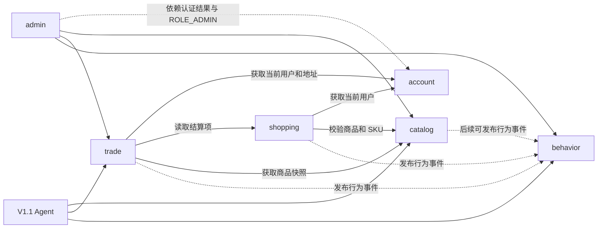

# PersonaFlow Commerce 模块约定

> 状态：account 约定已确定，catalog ProductQueryApi 约定已确定，其他模块仍为骨架版  
> 作用：确定模块之间允许如何调用，以及各模块需要向外提供什么能力  
> 当前确定范围：调用规则、依赖方向、account 对外 Java 接口与模型、catalog 商品快照查询接口与模型  
> 当前未确定范围：shopping、trade、behavior 的精确方法签名与模型  
> 更新时间：2026-06-26

---

## 1. 为什么需要这个文件

`v1.0-architecture.md` 说明整个项目有哪些模块，以及模块之间的大方向。

本文件进一步回答：

```txt
一个模块为什么需要另一个模块
调用方真正需要什么能力
能力由哪个模块提供
调用时传递什么类型的数据
调用失败时由谁负责处理
哪些内部类不能被其他模块访问
```

本文件不设计模块内部的 Controller、Service、Mapper 和 Entity。

模块内部结构由以下文件分别设计：

```text
docs/modules/
├── 01-account.md
├── 02-catalog.md
├── 03-shopping.md
├── 04-trade.md
└── 05-behavior.md
```

---

## 2. 如何设计一个模块约定

模块约定不是凭空想象出来的，而是从业务流程中推导

固定使用下面六步：

```txt
第一步：选择一条真实业务流程
第二步：确认这条流程需要哪些数据
第三步：确认数据由哪个模块拥有
第四步：调用方只提出自己需要的业务能力
第五步：提供方返回稳定的跨模块模型，不暴露 Entity
第六步：确认失败情况、事务责任和调用限制
```

### 2.1 示例：创建订单

创建订单需要：

```txt
当前用户是谁
用户选择了哪些购物车项
SKU 是否可以购买
商品名称、规格、价格和图片快照
库存是否足够
```

这些数据分别属于：

| 数据 | 数据拥有模块 |
|---|---|
| 当前用户 | account |
| 购物车项 | shopping |
| 商品和 SKU | catalog |
| 库存和订单 | trade |

因此 trade 不能直接查询其他模块的表，而是提出下面的能力需求：

```txt
向 account 获取当前用户
向 shopping 获取待结算购物车项
向 catalog 获取可购买 SKU 和商品快照
trade 自己负责扣减库存和创建订单
```

这就是模块约定的来源。

---

## 3. 模块与包的关系

项目固定采用五个业务模块。

| 业务模块 | 内部 Java 包 |
|---|---|
| account | auth、user |
| catalog | product |
| shopping | favorite、cart |
| trade | inventory、order |
| behavior | behavior、messaging |

`search` 包保留为 catalog 后续复杂搜索扩展方向，V1.0 不创建。简单关键词搜索由 `product` 包内的 `ProductService` 使用 MySQL LIKE 实现。

其他包：

| Java 包 | 定位 |
|---|---|
| common | 所有模块共享的技术基础 |
| admin | 调用现有模块能力的管理端 HTTP 入口 |

---

## 4. 模块依赖方向

箭头表示：

```txt
调用方 → 能力提供方
```



固定依赖关系：

| 调用方 | 提供方 | 主要原因 |
|---|---|---|
| shopping | account | 获取当前用户身份 |
| shopping | catalog | 校验商品、SPU 和 SKU |
| trade | account | 获取当前用户身份和收货地址快照 |
| trade | shopping | 读取并清理待结算购物车项 |
| trade | catalog | 获取可购买 SKU 和订单商品快照 |
| catalog | behavior | 后续 behavior API 确认后，可接入搜索和浏览事件发布 |
| shopping | behavior | 发布收藏和加购事件 |
| trade | behavior | 发布购买事件 |
| admin | account | 只依赖 Spring Security 认证结果与 `ROLE_ADMIN`，不调用账户管理接口 |
| admin | catalog、trade、behavior | 提供管理员 HTTP 入口并调用已有业务能力 |
| Agent | catalog、trade、behavior | 查询商品、订单和行为数据 |

---

## 5. 跨模块调用规则

### 5.1 允许

```txt
模块通过其他模块的 api 包调用公开能力
Controller 调用本模块 Service
Service 调用本模块 Mapper
跨模块使用专门的请求模型和返回模型
behavior API 确认后，业务模块可通过 BehaviorEventPublisher 发布行为事件
```

### 5.2 禁止

```txt
一个模块直接调用另一个模块的 Mapper
一个模块直接导入另一个模块的 Entity
一个 Controller 调用另一个 Controller
shopping 直接查询商品表
trade 直接查询用户表或购物车表
behavior 反向控制购物车、库存或订单
common 引用具体业务模块
admin 复制已有模块的业务逻辑
```

### 5.3 为什么不能暴露 Entity

Entity 对应数据库表，属于模块内部实现。

直接跨模块传递 Entity 会导致：

```txt
数据库字段变化会影响多个模块
调用方可以依赖自己不需要的字段
模块边界失效
后续拆分或重构成本增加
```

跨模块返回对象必须只包含调用方真正需要的数据。

---

## 6. 约定状态

每项约定使用下面四种状态：

| 状态 | 含义 |
|---|---|
| 计划中 | 已知道需要该能力，但尚未设计 |
| 草案 | 能力和数据大致确定，仍可修改 |
| 已确定 | 可以交给 Codex 实现，不应随意修改 |
| 已实现 | 代码和测试已经完成 |

当前文件中的能力大部分处于“计划中”或“草案”。

只有完成对应模块详细设计后，才能标记为“已确定”。

---

## 7. account 模块对外能力

account 详细设计已完成，本节约定标记为“已确定”。

account 对外只提供当前确实存在调用方的能力。

```txt
shopping 需要当前用户身份
trade 需要当前用户身份
trade 需要经过归属校验的地址快照
admin 只依赖 Spring Security 的 ROLE_ADMIN 校验
```

V1.0 不提供通用的用户查询或账户管理接口。

---

### 7.1 获取当前登录用户

状态：

```txt
已确定
```

使用者：

```txt
shopping
trade
```

Java 接口：

```java
public interface CurrentUserProvider {

    CurrentUser requireCurrentUser();
}
```

返回模型：

```java
public record CurrentUser(
        Long userId,
        Set<String> roles
) {
}
```

能力说明：

```txt
从 Spring Security 的 SecurityContext 中读取当前认证用户
只返回 userId 和 roles
未登录时抛出 account 模块定义的未认证异常
调用方不需要解析 JWT
调用方不需要查询 sys_user、user_login_identity 或 sys_role
前端 `/api/users/me` 返回 username 属于 account HTTP 接口自身查询结果，不属于跨模块约定
```

固定限制：

```txt
不返回 username
不返回 passwordHash
不返回收货地址
不返回数据库 Entity
shopping 和 trade 不能直接读取 SecurityContext
```

---

### 7.2 V1.0 不提供通用用户查询接口

状态：

```txt
已确定
```

原计划中的 `UserQueryApi` 在 V1.0 暂不提供。

原因：

```txt
shopping 只需要当前 userId
trade 只需要当前 userId 和地址快照
admin 不管理其他账户
目前没有模块真正需要按 userId 查询用户信息；V1.0 不提供 UserQueryApi 或 UserSummary
```

为了避免提前设计没有调用方的接口，等后续出现真实需求时再新增对应约定。

---

### 7.3 查询并校验收货地址

状态：

```txt
已确定
```

使用者：

```txt
trade
```

Java 接口：

```java
public interface AddressQueryApi {

    AddressSnapshot requireOwnedAddress(Long userId, Long addressId);
}
```

返回模型：

```java
public record AddressSnapshot(
        Long addressId,
        String recipientName,
        String recipientPhone,
        String province,
        String city,
        String district,
        String detailAddress,
        String postalCode
) {
}
```

业务要求：

```txt
地址必须存在
地址必须属于传入的 userId
返回创建订单所需的地址快照
不能返回 AddressEntity
trade 将快照复制到订单，不长期依赖 user_address 当前值
```

异常责任：

```txt
地址不存在由 account 识别
地址不属于当前用户由 account 识别
trade 接收异常后终止创建订单
```

---

### 7.4 admin 与 account 的边界

状态：

```txt
已确定
```

V1.0 中 admin 不调用账户管理 Java 接口。

```txt
管理员与普通用户使用同一套 account 登录流程
管理员通过 sys_user、sys_role、sys_user_role 获得 ROLE_ADMIN
Spring Security 在进入 admin Controller 前完成角色校验
admin 不封号、不解封、不修改他人密码、不修改他人资料、不分配角色
```

因此 account 不向 admin 公开：

```txt
用户封禁接口
角色修改接口
他人资料修改接口
密码重置接口
```

## 8. catalog 模块对外能力

catalog 详细设计已完成，本节约定标记为“已确定”。

catalog 对外只提供 shopping 和 trade 当前确实需要的商品快照查询能力。

```txt
shopping 加购需要校验 SKU 是否可售，并获得商品展示快照
trade 创建订单需要校验 SKU 是否可售，并复制订单商品价格快照
库存是否足够、库存锁定和库存扣减由 trade/inventory 负责
```

V1.0 不提供复杂商品后台 Java API，不提供跨模块商品详情 Entity 查询。

---

### 8.1 查询并校验可售 SKU

状态：

```txt
已确定
```

使用者：

```txt
shopping
trade
```

Java 接口：

```java
public interface ProductQueryApi {

    ProductSnapshot requireSellableSku(Long skuId);

    Map<Long, ProductSnapshot> requireSellableSkus(Collection<Long> skuIds);
}
```

返回模型：

```java
public record ProductSnapshot(
        Long skuId,
        Long spuId,
        Long categoryId,
        String categoryName,
        String productName,
        String skuName,
        BigDecimal unitPrice,
        String imageUrl
) {
}
```

能力说明：

```txt
requireSellableSku 用于 shopping 加购、trade 创建订单
requireSellableSkus 用于购物车列表和订单创建时批量查询
unitPrice 是当前商品单价，trade 创建订单时保存为订单价格快照
imageUrl 是展示图，优先使用 SKU 图片，没有则使用 SPU 主图
categoryId 和 categoryName 保留，方便后续 behavior 和 Agent 分析
```

校验规则：

```txt
SKU 必须存在
SKU 必须可售
SPU 必须存在
SPU 必须上架
Category 必须存在
Category 必须启用
```

固定限制：

```txt
不返回 Entity
不返回库存
不负责扣库存
不负责库存流水
不负责库存锁定
不负责下单库存校验
不返回 description、detailImages、attributes 等商品详情字段
不使用 skuDescription
不同时暴露 mainImageUrl 和 skuImageUrl 给跨模块快照
```

异常责任：

```txt
SKU 不存在由 catalog 识别
商品或分类不存在由 catalog 识别
SKU、SPU 或 Category 不可售由 catalog 识别
shopping 和 trade 接收异常后终止当前业务
```

---

### 8.2 V1.0 不提供跨模块商品详情查询接口

状态：

```txt
已确定
```

V1.0 商品详情面向前端 HTTP 浏览接口提供：

```txt
GET /api/catalog/products/{spuId}
```

其他业务模块不直接读取 catalog Entity，不通过跨模块 API 获取完整详情。

原因：

```txt
shopping 和 trade 当前只需要 SKU 可售校验与商品快照
完整 description、detailImages、attributes 属于前端展示数据
Agent 相关查询等 V1.1 或后续 behavior/catalog 查询能力确认后再设计
```

---

## 9. shopping 模块对外能力

### 9.1 获取待结算购物车项

状态：

```txt
计划中
```

使用者：

```txt
trade
```

业务要求：

```txt
购物车项必须属于当前用户
请求中的 itemId 必须真实存在
返回 skuId 和购买数量
不能把 ShoppingCart Entity 暴露给 trade
```

暂定约定名称：

```java
CartCheckoutApi
```

---

### 9.2 移除已购买购物车项

状态：

```txt
计划中
```

使用者：

```txt
trade
```

调用时机：

```txt
订单创建成功后
```

需要进一步确认：

```txt
是否与订单创建处于同一事务
删除失败时订单是否回滚
是否使用同步调用
```

这些问题在 `modules/04-trade.md` 中最终确定。

---

## 10. trade 模块对外能力

### 10.1 查询订单摘要

状态：

```txt
计划中
```

使用者：

```txt
admin
Agent
```

返回内容可能包括：

```txt
orderId
orderNo
userId
totalAmount
status
createdAt
```

普通用户查询订单时通过 HTTP 接口访问，不直接使用该跨模块能力。

---

## 11. behavior 模块对外能力

### 11.1 发布行为事件

状态：

```txt
草案
```

使用者：

```txt
catalog
shopping
trade
```

行为类型：

```txt
SEARCH
VIEW
FAVORITE
ADD_TO_CART
PURCHASE
NEGATIVE_FEEDBACK
```

暂定约定名称：

```java
BehaviorEventPublisher
```

发布方只负责描述已经发生的业务事实。

behavior 模块负责：

```txt
事件信封
RabbitMQ 路由
重试
死信
消费幂等
MySQL 持久化
Redis 热词和兴趣统计
```

---

### 11.2 查询行为和兴趣数据

状态：

```txt
计划中
```

使用者：

```txt
admin
Agent
```

查询能力可能包括：

```txt
查询用户近期行为
查询用户兴趣分类
查询每日搜索热词
查询某类行为统计
```

精确范围在 behavior 模块设计时确定。

---

## 12. 事务责任

跨模块调用不代表多个模块可以任意开启事务。

当前原则：

| 业务流程 | 事务协调模块 |
|---|---|
| account 注册 | account |
| account 修改资料、密码和地址 | account |
| 登录查询与 JWT 生成 | 不需要写事务 |
| 收藏和加购 | shopping |
| 创建订单和扣减库存 | trade |
| 取消订单和恢复库存 | trade |
| 行为持久化 | behavior 消费者 |

account 注册事务包括：

```txt
写入 sys_user
写入 user_login_identity
写入 sys_user_role
任一步失败时全部回滚
```

创建订单流程中：

```txt
trade 是事务协调者
inventory 和 order 同属 trade
catalog 只提供商品快照
shopping 提供购物车结算项
behavior 事件应在业务成功后发布
```

事务和消息一致性的最终方案在 trade 与 behavior 模块设计时确定。

---

## 13. 异常责任

提供方负责识别自己拥有的数据和业务规则。

示例：

| 场景 | 负责模块 |
|---|---|
| 用户名已经存在 | account |
| 账号或密码错误 | account |
| 当前请求未登录或 Token 无效 | account |
| 当前用户没有管理员权限 | account / Spring Security |
| 地址不存在或不属于当前用户 | account |
| 商品不存在或已下架 | catalog |
| 购物车项不属于当前用户 | shopping |
| 库存不足 | trade |
| 订单状态不允许支付 | trade |
| 消息重复消费 | behavior |

V1.0 不设计管理员封号，因此不包含“用户被禁用”的业务异常。

调用方负责决定上层业务是否继续、回滚或返回错误。

---

## 14. Codex 实现约束

account 实现前必须读取：

```text
docs/v1.0-architecture.md
docs/module-contracts.md
docs/modules/01-account.md
```

account 当前所需的数据库、HTTP 接口、错误码、类清单和测试标准已经写入 `01-account.md`，本轮不要求先完成其他模块文档。

固定约束：

```txt
不得直接调用其他模块 Mapper
不得直接导入其他模块 Entity
不得自行修改已确定约定
不得新增 UserQueryApi 等没有真实调用方的接口
不得实现封号、角色管理、邮箱登录、手机号登录身份、短信验证码、OAuth、Refresh Token 或服务端 Token 黑名单
不得让 admin 修改账户
发现约定冲突或缺失时停止实现并报告
只实现当前任务允许的文件范围
完成后报告修改文件、测试结果和未解决问题
```

catalog 的 ProductQueryApi 与 ProductSnapshot 已在本文件和 `modules/02-catalog.md` 中确定。未来 shopping、trade 和 behavior 开工前，再逐步补充对应的数据库、HTTP 和事件约定。

---

## 15. 当前状态与下一步

### 已完成

```txt
总体模块依赖方向
跨模块调用规则
account 详细技术设计
CurrentUserProvider 精确签名
CurrentUser 精确模型
AddressQueryApi 精确签名
AddressSnapshot 精确模型
admin 与 account 的权限边界
account 事务与异常责任
catalog ProductQueryApi 精确签名
ProductSnapshot 精确模型
```

### 下一步

```txt
进入 catalog 阶段 1
只实现 Flyway 表、Entity、Mapper 和初始化演示数据
不实现 Controller、Service、Redis、admin、shopping、trade、behavior 或 Agent
完成后编译并报告未解决问题
```

shopping、trade 和 behavior 文档在对应模块开工前继续收口。
