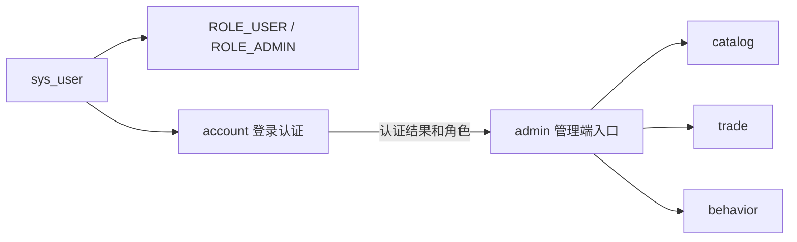
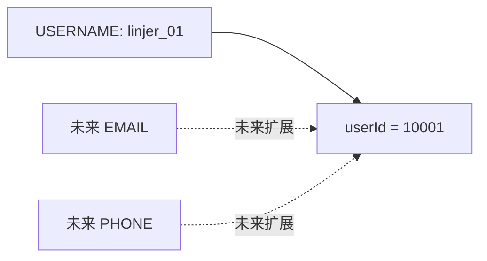
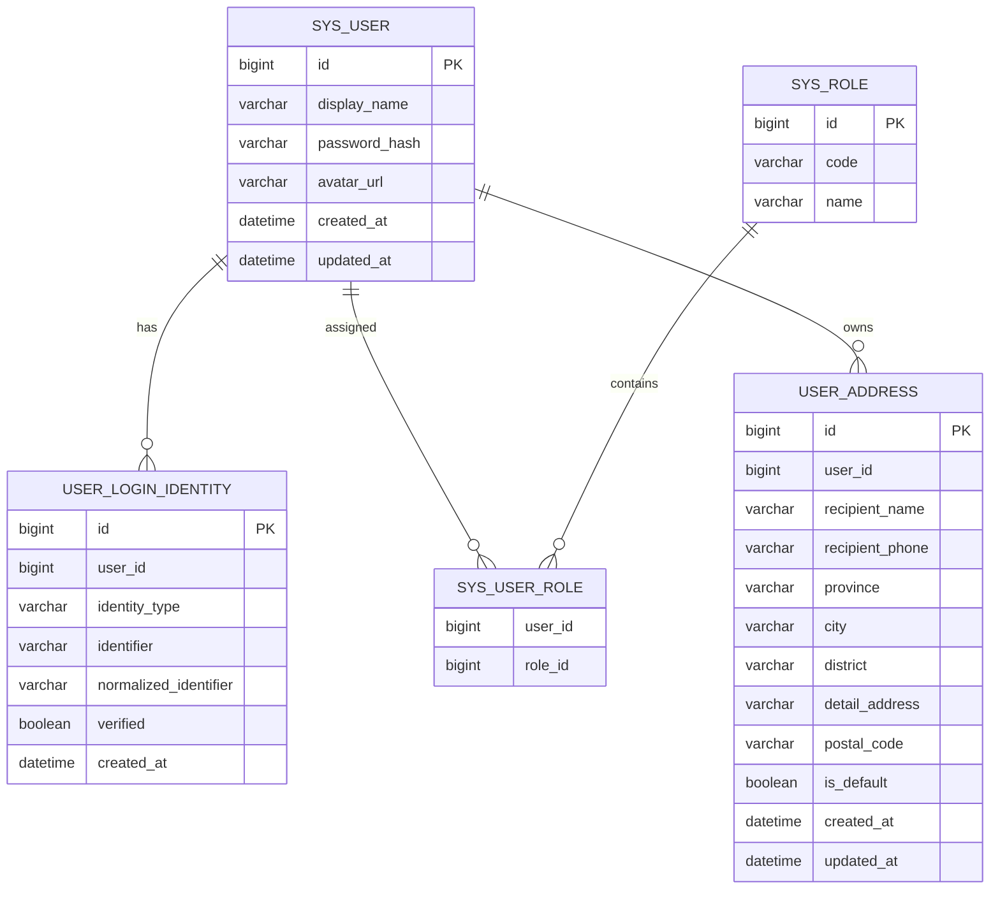
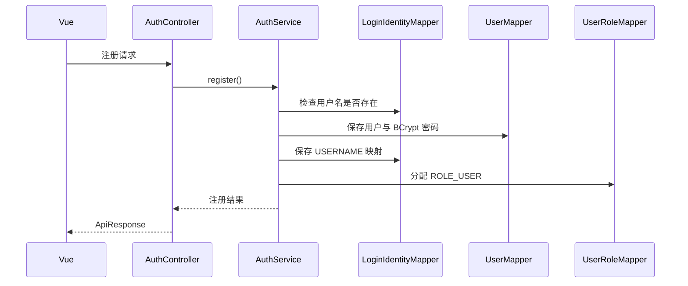
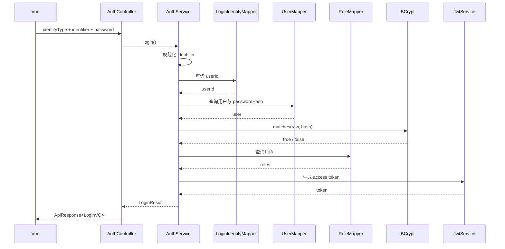
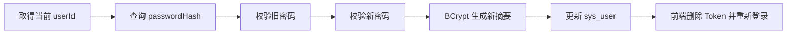
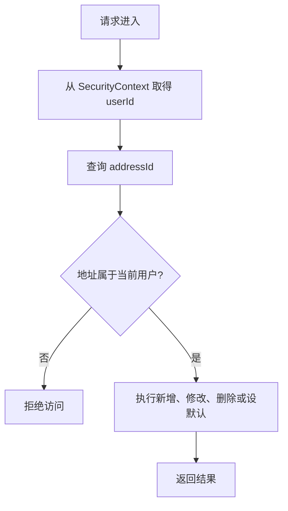
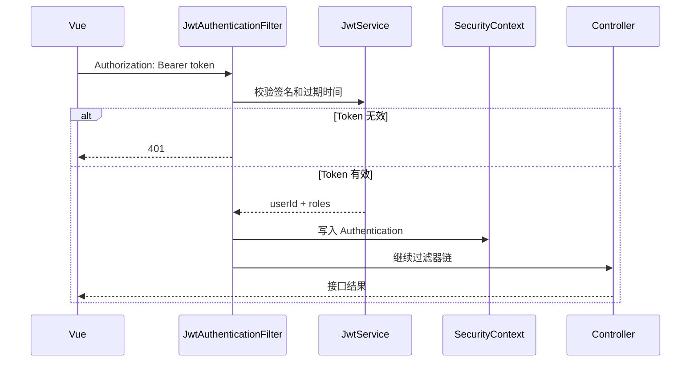
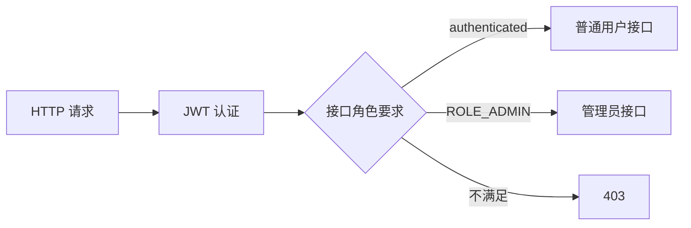
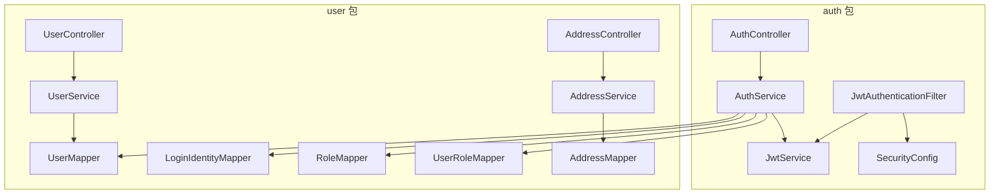

# PersonaFlow Commerce：account 模块技术设计

> 文档类型：技术设计  
> 目标读者：项目协作者、代码审查者、面试官、Codex  
> 目标版本：V1.0  
> 状态：设计已确认，跨模块约定已确定  
> 模块组成：`auth` + `user`  
> 最后更新：2026-06-26

---

## 1. 模块目标

account 模块解决两个问题：

```txt
系统如何确认当前请求是谁发出的
用户如何管理自己的基本资料与收货地址
```

account 模块由两个 Java 包组成：

```text
auth
负责注册、登录、JWT、Spring Security、当前用户身份和角色

user
负责用户主体、展示资料、登录身份、角色关系、密码修改和收货地址
```

account 向其他模块提供稳定的用户身份能力，但不处理商品、购物车、库存、订单或行为统计。

---

## 2. V1.0 功能范围

### 2.1 本版本完成

```txt
用户名和密码注册
用户名和密码登录
JWT 生成与校验
登录后查询当前账户
修改展示名称
修改密码
收货地址增删改查
普通用户与管理员角色
为 shopping 提供当前 userId
为 trade 提供当前用户身份与地址快照
```

### 2.2 本版本不完成

```txt
手机号登录身份
邮箱登录身份
短信验证码
OAuth 第三方登录
找回密码
头像文件上传
服务端 Token 黑名单
Refresh Token
管理员封号或解封
管理员修改其他用户资料
管理员分配或撤销角色
用户注销账户
```

这里的“手机号不实现”只指手机号登录、短信验证码和手机号登录身份；`user_address.recipient_phone` 仍然保留，作为收货地址联系电话。

### 2.3 admin 与 account 的关系

admin 不是另一套账户系统。

管理员仍然是 `sys_user` 中的一名普通用户，只是拥有 `ROLE_ADMIN`。



V1.0 中：

```txt
admin 通过 account 完成登录和权限校验
admin 可以操作商品、库存、订单和行为查询
admin 不能封号、改密码、改资料或修改其他账户
account 不提供管理员账户管理接口
```

---

## 3. 核心概念

### 3.1 内部用户 ID

`userId` 是系统内部身份：

```txt
由系统生成
全局唯一
创建后不可修改
用于关联购物车、订单、收藏和行为
不能作为登录账号
```

### 3.2 登录身份

登录身份是用户输入的外部标识：

```txt
USERNAME
未来可扩展 EMAIL
未来可扩展 PHONE
```

V1.0 只实现 `USERNAME`。

多个外部登录身份理论上可以映射到同一个内部 `userId`：



### 3.3 展示名称

`displayName` 只用于前端展示：

```txt
可以重复
可以修改
不能登录
不能替代 userId
```

### 3.4 密码

数据库不保存明文密码，只保存 BCrypt 结果：

```text
用户输入密码
→ BCrypt matches
→ 与 password_hash 比较
```

### 3.5 收货地址

一个用户可以拥有多个地址，因此地址使用独立表。

```text
sys_user 1 ── N user_address
```

trade 创建订单时使用 `userId + addressId` 向 account 请求地址快照，不能直接查询地址表。

---

## 4. 数据模型

## 4.1 ER 图



## 4.2 `sys_user`

| 字段 | 类型 | 约束 | 说明 |
|---|---|---|---|
| `id` | BIGINT | PK | 内部用户 ID，不可修改 |
| `display_name` | VARCHAR(50) | NOT NULL | 前端展示名称，可以重复 |
| `password_hash` | VARCHAR(100) | NOT NULL | BCrypt 密码摘要 |
| `avatar_url` | VARCHAR(500) | NULL | 头像 URL，可作为可选字符串修改；V1.0 不实现上传、对象存储、裁剪或审核 |
| `created_at` | DATETIME | NOT NULL | 创建时间 |
| `updated_at` | DATETIME | NOT NULL | 更新时间 |

V1.0 不提供封号功能，因此不在业务流程中使用账户状态变更。

## 4.3 `user_login_identity`

| 字段 | 类型 | 约束 | 说明 |
|---|---|---|---|
| `id` | BIGINT | PK | 登录身份记录 ID |
| `user_id` | BIGINT | NOT NULL | 对应内部用户 |
| `identity_type` | VARCHAR(20) | NOT NULL | V1.0 固定为 `USERNAME` |
| `identifier` | VARCHAR(100) | NOT NULL | 用户输入的原始账号 |
| `normalized_identifier` | VARCHAR(100) | NOT NULL | 规范化账号，用于查询与唯一校验 |
| `verified` | BOOLEAN | NOT NULL | USERNAME 注册后直接为 true |
| `created_at` | DATETIME | NOT NULL | 创建时间 |

唯一约束：

```text
UNIQUE(identity_type, normalized_identifier)
```

用户名规范化规则：

```text
去除首尾空格
转为小写
```

## 4.4 `sys_role`

| 字段 | 类型 | 约束 | 说明 |
|---|---|---|---|
| `id` | BIGINT | PK | 角色 ID |
| `code` | VARCHAR(50) | UNIQUE, NOT NULL | `ROLE_USER` 或 `ROLE_ADMIN` |
| `name` | VARCHAR(50) | NOT NULL | 展示名称 |

Flyway 初始化必须写入 `ROLE_USER`、`ROLE_ADMIN`、一个普通演示用户和一个管理员演示用户。演示账号只用于初始化、联调和权限验证，不代表 V1.0 提供管理员账户管理能力。

## 4.5 `sys_user_role`

| 字段 | 类型 | 约束 | 说明 |
|---|---|---|---|
| `user_id` | BIGINT | PK 组成部分 | 用户 ID |
| `role_id` | BIGINT | PK 组成部分 | 角色 ID |

唯一约束：

```text
UNIQUE(user_id, role_id)
```

## 4.6 `user_address`

| 字段 | 类型 | 约束 | 说明 |
|---|---|---|---|
| `id` | BIGINT | PK | 地址 ID |
| `user_id` | BIGINT | NOT NULL | 地址所属用户 |
| `recipient_name` | VARCHAR(50) | NOT NULL | 收货人 |
| `recipient_phone` | VARCHAR(30) | NOT NULL | 联系电话 |
| `province` | VARCHAR(50) | NOT NULL | 省 |
| `city` | VARCHAR(50) | NOT NULL | 市 |
| `district` | VARCHAR(50) | NOT NULL | 区县 |
| `detail_address` | VARCHAR(255) | NOT NULL | 详细地址 |
| `postal_code` | VARCHAR(20) | NULL | 邮编 |
| `is_default` | BOOLEAN | NOT NULL | 是否默认地址 |
| `created_at` | DATETIME | NOT NULL | 创建时间 |
| `updated_at` | DATETIME | NOT NULL | 更新时间 |

规则：

```txt
用户只能操作自己的地址
每个用户最多一个默认地址
删除默认地址后不自动选择新的默认地址
新增第一个地址时自动设为默认地址
订单只保存地址快照，不依赖地址当前值
```

---

## 5. HTTP 接口约定

所有成功和失败响应使用统一的 `ApiResponse<T>`。
`ApiResponse.code` 保持 `int`；字符串业务错误码使用 `errorCode` 表示，例如 `ACCOUNT_USERNAME_EXISTS`、`ACCOUNT_UNAUTHORIZED`。不得把 `ApiResponse.code` 改成字符串。

## 5.1 注册

```http
POST /api/auth/register
```

请求：

```json
{
  "username": "linjer_01",
  "password": "Example123!",
  "displayName": "林同学"
}
```

校验：

```txt
username：4～32 个字符，只允许字母、数字和下划线
password：8～64 个字符，至少包含字母和数字
displayName：1～50 个字符
```

成功返回：

```json
{
  "code": 0,
  "message": "success",
  "data": {
    "userId": 10001,
    "username": "linjer_01",
    "displayName": "林同学"
  }
}
```

注册事务：



上述三个写操作位于同一事务。

## 5.2 登录

```http
POST /api/auth/login
```

请求：

```json
{
  "identityType": "USERNAME",
  "identifier": "linjer_01",
  "password": "Example123!"
}
```

成功返回：

```json
{
  "code": 0,
  "message": "success",
  "data": {
    "accessToken": "jwt-token",
    "tokenType": "Bearer",
    "expiresIn": 7200,
    "user": {
      "id": 10001,
      "username": "linjer_01",
      "displayName": "林同学",
      "roles": ["ROLE_USER"]
    }
  }
}
```

登录流程：



## 5.3 查询当前账户

```http
GET /api/users/me
Authorization: Bearer <token>
```

返回：

```json
{
  "code": 0,
  "message": "success",
  "data": {
    "id": 10001,
    "username": "linjer_01",
    "displayName": "林同学",
    "avatarUrl": null,
    "roles": ["ROLE_USER"]
  }
}
```

不返回：

```txt
passwordHash
完整 JWT 内容
其他用户信息
```

## 5.4 修改展示资料

```http
PATCH /api/users/me
Authorization: Bearer <token>
```

请求：

```json
{
  "displayName": "新的展示名称",
  "avatarUrl": null
}
```

允许修改：

```txt
displayName
avatarUrl
```

`avatarUrl` 只作为可选字符串字段修改；V1.0 不实现头像上传、对象存储、裁剪或审核。

禁止修改：

```txt
userId
username
roles
```

## 5.5 修改密码

```http
PUT /api/users/me/password
Authorization: Bearer <token>
```

请求：

```json
{
  "oldPassword": "Example123!",
  "newPassword": "NewExample456!"
}
```

流程：



V1.0 不实现服务端 Token 撤销。修改密码后，当前前端必须清除 Token 并要求重新登录；其他已经签发的 Token 会在自身过期时间到达后失效。

## 5.6 地址接口

```http
GET    /api/users/me/addresses
POST   /api/users/me/addresses
PUT    /api/users/me/addresses/{addressId}
DELETE /api/users/me/addresses/{addressId}
PUT    /api/users/me/addresses/{addressId}/default
```

所有接口都要求登录。

地址操作流程：



---

## 6. JWT 约定

JWT claims：

```json
{
  "sub": "10001",
  "roles": ["ROLE_USER"],
  "jti": "token-uuid",
  "iat": 1782496800,
  "exp": 1782504000
}
```

规则：

```txt
sub 使用 userId
有效期 2 小时
使用配置文件中的密钥签名
密钥从环境变量读取
不把密码、地址、收货联系电话等敏感或易变数据放进 Token
```

---

## 7. 认证请求流程



权限判断：



---

## 8. account 内部结构



---

## 9. 计划创建的类

### 9.1 auth 包

```text
auth/controller/AuthController.java
auth/service/AuthService.java
auth/security/SecurityConfig.java
auth/security/JwtAuthenticationFilter.java
auth/security/JwtService.java
auth/security/AuthenticatedUser.java
auth/dto/RegisterRequest.java
auth/dto/LoginRequest.java
auth/vo/RegisterVO.java
auth/vo/LoginVO.java
```

### 9.2 user 包

```text
user/controller/UserController.java
user/controller/AddressController.java
user/service/UserService.java
user/service/AddressService.java
user/mapper/UserMapper.java
user/mapper/LoginIdentityMapper.java
user/mapper/RoleMapper.java
user/mapper/UserRoleMapper.java
user/mapper/AddressMapper.java
user/entity/UserEntity.java
user/entity/LoginIdentityEntity.java
user/entity/RoleEntity.java
user/entity/UserRoleEntity.java
user/entity/AddressEntity.java
user/dto/UpdateProfileRequest.java
user/dto/ChangePasswordRequest.java
user/dto/CreateAddressRequest.java
user/dto/UpdateAddressRequest.java
user/vo/CurrentUserVO.java
user/vo/UserProfileVO.java
user/vo/AddressVO.java
```

### 9.3 对其他模块公开的 api

```text
user/api/CurrentUserProvider.java
user/api/AddressQueryApi.java
user/api/model/CurrentUser.java
user/api/model/AddressSnapshot.java
```

---

## 10. 跨模块 Java 约定

```java
public interface CurrentUserProvider {

    CurrentUser requireCurrentUser();
}
```

```java
public record CurrentUser(
        Long userId,
        Set<String> roles
) {
}
```

```java
public interface AddressQueryApi {

    AddressSnapshot requireOwnedAddress(Long userId, Long addressId);
}
```

```java
public record AddressSnapshot(
        Long addressId,
        String recipientName,
        String recipientPhone,
        String province,
        String city,
        String district,
        String detailAddress,
        String postalCode
) {
}
```

用途：

```txt
shopping 使用 CurrentUserProvider 取得当前 userId 和 roles
trade 使用 CurrentUserProvider 取得当前 userId 和 roles
trade 使用 AddressQueryApi 获取经过归属校验的地址快照
admin 只使用 Spring Security 角色校验，不调用账户管理能力
V1.0 不提供没有真实调用方的通用 UserQueryApi 或 UserSummary
前端 `/api/users/me` 仍可返回 username，但这是 account HTTP 接口自身查询结果，不属于跨模块约定
```

---

## 11. 错误码

| 错误码 | HTTP 状态 | 场景 |
|---|---:|---|
| `ACCOUNT_USERNAME_EXISTS` | 409 | 用户名已经存在 |
| `ACCOUNT_INVALID_CREDENTIALS` | 401 | 用户名或密码错误 |
| `ACCOUNT_UNAUTHORIZED` | 401 | 未登录或 Token 无效 |
| `ACCOUNT_FORBIDDEN` | 403 | 没有对应角色 |
| `ACCOUNT_CURRENT_PASSWORD_INVALID` | 400 | 当前密码错误 |
| `ACCOUNT_PASSWORD_INVALID` | 400 | 新密码格式不合法 |
| `ACCOUNT_ADDRESS_NOT_FOUND` | 404 | 地址不存在或不属于当前用户 |

登录失败统一返回“账号或密码错误”，不能向外区分用户名不存在和密码错误。
失败响应中，`ApiResponse.code` 仍为 `int`，上表中的字符串值放入 `errorCode` 字段。

---

## 12. 事务边界

| 业务 | 事务负责方 | 事务范围 |
|---|---|---|
| 注册 | `AuthService` | 用户、登录身份、默认角色 |
| 修改资料 | `UserService` | 单表更新 |
| 修改密码 | `UserService` | 密码摘要更新 |
| 新增地址 | `AddressService` | 新增地址与默认地址调整 |
| 设置默认地址 | `AddressService` | 清除旧默认并设置新默认 |

---

## 13. 测试与验收

### 13.1 注册

```txt
正常注册成功
重复 username 返回 409
username 大小写不同仍视为重复
密码不符合规则返回 400
注册后自动拥有 ROLE_USER
三个写操作任一步失败时全部回滚
```

### 13.2 登录与认证

```txt
正确账号密码返回 JWT
错误密码返回 401
不存在的账号返回相同的 401 错误
无 Token 访问受保护接口返回 401
无效或过期 Token 返回 401
验证 ROLE_ADMIN 权限规则：普通用户不满足 ROLE_ADMIN 时返回 403
验证 ROLE_ADMIN 权限规则：拥有 ROLE_ADMIN 的认证请求可以通过权限校验
account 阶段不新增生产环境 admin 业务 Controller，可通过测试专用端点或 Security 配置测试验证权限规则
```

### 13.3 用户资料

```txt
登录用户可以查询自己的资料
登录用户可以修改 displayName
不能通过请求修改 userId、username 或 roles
修改密码必须校验旧密码
```

### 13.4 地址

```txt
用户可以新增、修改、删除自己的地址
用户不能读取或修改其他用户地址
第一个地址自动成为默认地址
设置新默认地址后旧默认地址取消
trade 可以取得经过归属校验的 AddressSnapshot
```

### 13.5 构建

```txt
mvn test 通过
Spring Boot 启动成功
Flyway 可以从空数据库完成 account 表、ROLE_USER、ROLE_ADMIN、一个普通演示用户和一个管理员演示用户初始化
Vue 可以完成注册、登录、资料、密码和地址联调
```

---

## 14. Codex 实现约束

Codex 必须先阅读：

```text
docs/v1.0-architecture.md
docs/module-contracts.md
docs/modules/01-account.md
```

实现限制：

```txt
只实现 account 所需的 auth 和 user 包
不得实现封号、角色管理、邮箱登录、手机号登录身份、短信验证码、OAuth、Refresh Token 和服务端 Token 黑名单
不得在 admin 中新增账户管理接口
account 阶段不得新增生产环境 admin 业务 Controller
不得把密码、passwordHash 或完整地址写入 JWT
不得让 shopping 或 trade 直接调用 account Mapper
不得自行修改已确定的 HTTP 路径和跨模块 Java 接口
发现文档冲突时停止并报告
```

---

## 15. 后续模块依赖

account 完成后提供：

```txt
shopping 获取当前 userId
trade 获取当前 userId
trade 获取地址快照
admin 使用 ROLE_ADMIN 权限
```

account 不依赖 catalog、shopping、trade 或 behavior，因此可以作为第一个业务模块独立实现。
