# PersonaFlow Commerce V1.0 架构设计

> 状态：总体架构已确定，详细模块设计待补充  
> 目标版本：V1.0.0  
> 项目定位：为java后端技术学习和搭建的单体电商项目，并为 V1.1 Agent 接入准备行为数据  
> 更新时间：2026-06-26

---

## 1. 文档目的

本文件只负责确定整个项目的稳定边界：

```txt
- V1.0要完成哪些业务
- 系统分成哪些模块
- V1.0 Java 包分别归属哪个模块
- 各模块拥有哪些数据
- 各模块之间允许如何通信
- MySQL、Redis、RabbitMQ分别负责什么
- V1.1Agent将从哪里读取数据、调用哪些能力
- 后续设计文档和Codex辅助必须遵守哪些规则
```

本文件不直接写完所有 DTO、VO、数据库字段和 Java 方法签名  
这些内容分别在以下文档中确定：

```text
docs/
├── v1.0-architecture.md     # 总体架构与模块边界
├── module-contracts.md      # 模块之间公开的 Java 接口
├── database.md              # 表、字段、约束和数据归属
├── api-contract.md          # HTTP 接口、请求、响应和错误码
├── event-contract.md        # RabbitMQ 事件、路由、幂等和重试
├── key-flows.md             # 关键业务时序图
└── modules/
    ├── 01-account.md
    ├── 02-catalog.md
    ├── 03-shopping.md
    ├── 04-trade.md
    └── 05-behavior.md
```

---

## 2. 项目目标与范围

### 2.1 V1.0 核心交易链路

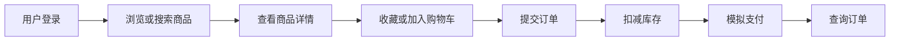

### 2.2 V1.0 行为数据链路

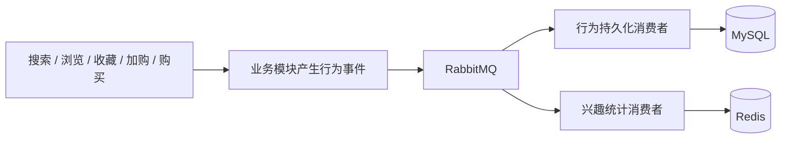

### 2.3 V1.0 完成的内容

```txt
- 用户名注册、用户登录、身份认证和角色校验
- 当前账户、密码修改和收货地址管理
- 商品分类、SPU、SKU、列表、详情和搜索
- 收藏与购物车
- 库存扣减、恢复和防超卖
- 订单创建、查询、取消和模拟支付
- 搜索、浏览、收藏、加购和购买行为事件
- RabbitMQ 消息投递、消费、幂等、重试和死信
- Redis 商品缓存、搜索热词和用户兴趣统计
- 最小管理端接口
- Vue 前端完成主链路联调
- 为 V1.1 Agent 提供结构化商品、订单和行为数据
```

---

## 3. 总体运行架构

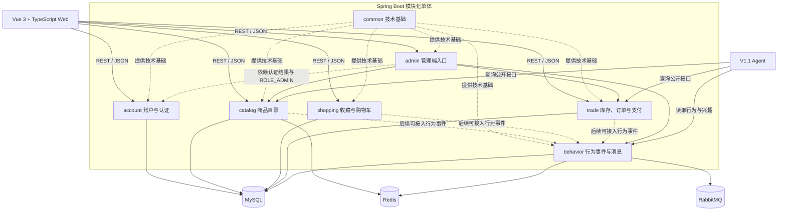

运行实例固定为：

```txt
- 一个 Spring Boot 后端
- 一个 Vue 前端
- 一个 MySQL
- 一个 Redis
- 一个 RabbitMQ
```

本地基础设施由 Docker Compose 管理。

---

## 4. 固定模块口径：5 个业务模块、V1.0 Java 包

“5 个业务模块”用于描述业务边界。
“V1.0 Java 包”用于组织代码。
两者不是互相替代，而是上下级关系。

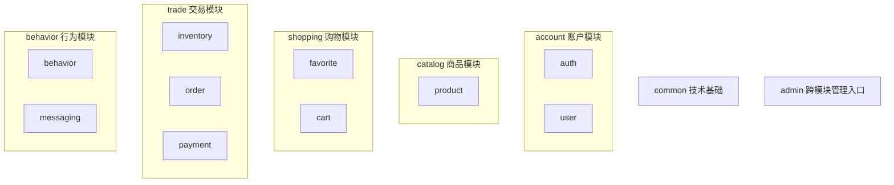

### 4.1 包与模块映射

| Java 包 | 所属模块 | 主要职责 |
|---|---|---|
| `common` | 技术基础 | 统一返回、异常、校验、分页、日志和通用配置 |
| `auth` | account | 注册、登录、JWT、Spring Security、当前用户 |
| `user` | account | 用户主体、登录身份映射、角色、资料、密码和收货地址 |
| `product` | catalog | 分类、SPU、SKU、价格、商品状态、详情和简单关键词搜索 |
| `favorite` | shopping | 收藏、取消收藏、收藏列表和重复收藏校验 |
| `cart` | shopping | 加购、修改数量、删除、清空购物车和购物车列表 |
| `inventory` | trade | 库存查询、扣减、恢复、乐观锁和库存变更 |
| `order` | trade | 创建订单、订单项快照、查询、取消和订单 HTTP 入口 |
| `payment` | trade | 模拟支付、支付记录和支付结果模型 |
| `behavior` | behavior | 行为模型、持久化、查询和兴趣统计 |
| `messaging` | behavior | RabbitMQ 配置、发布、消费、ACK、重试和死信 |
| `admin` | 跨模块入口 | 管理员 HTTP 接口，依赖 ROLE_ADMIN，不管理账户且不复制业务逻辑 |

---

## 5. 各模块职责、数据和技术

### 5.1 common：技术基础

负责：

```txt
- `ApiResponse<T>` 统一响应
- 统一错误码
- 全局异常处理
- Bean Validation 参数校验
- 分页请求和分页响应
- TraceId 与日志
- Jackson、MyBatis-Plus、Redis、RabbitMQ 等通用配置
- 时间、ID 等少量通用工具
```

不负责：

```txt
- 不拥有电商业务表
- 不引用账户、商品、购物车、订单等业务概念
- 不成为“所有代码都往里塞”的工具包
```

| 技术 | 作用 |
|---|---|
| Spring MVC | 接收 HTTP 请求并返回 JSON |
| Spring Validation | 校验请求参数 |
| `@ControllerAdvice` | 统一处理异常 |
| SLF4J / Logback | 记录业务与错误日志 |
| Actuator | 检查应用和中间件状态 |

### 5.2 account：账户与认证

由 `auth` 和 `user` 两个包组成。

负责：

```txt
用户名和密码注册
用户名和密码登录
外部登录身份与内部 userId 的映射
BCrypt 密码保存与校验
JWT 生成与解析
Spring Security 认证过滤
查询当前用户
修改展示资料
修改密码
普通用户与管理员角色
收货地址增删改查
avatarUrl 作为可选字符串字段修改，但不实现头像上传、对象存储、裁剪或审核
```

拥有的数据：

```text
sys_user
user_login_identity
sys_role
sys_user_role
user_address
```

核心身份规则：

```txt
userId 是系统内部唯一身份，由系统生成且不可修改
username 是 V1.0 的外部登录身份，必须唯一，注册后不可修改
displayName 只用于前端展示，可以修改且可以重复
一个 userId 可以在未来映射 EMAIL、PHONE 等其他登录身份
V1.0 只实现 USERNAME + PASSWORD
手机号不实现只指手机号登录、短信验证码和手机号登录身份；收货地址联系电话仍由 user_address.recipient_phone 保存
```

对其他模块提供：

```txt
向 shopping 和 trade 提供当前登录用户身份（userId + roles，不含 username）
向 trade 提供经过归属校验的收货地址快照
不提供通用 UserQueryApi 或 UserSummary
不向 admin 提供封号、改密、改资料或角色管理接口
```

管理员规则：

```txt
管理员仍然是 sys_user 中的用户
管理员通过 sys_user_role 获得 ROLE_ADMIN
admin 只使用 Spring Security 的认证结果与 ROLE_ADMIN 校验
V1.0 不实现封号、解封、管理员重置密码或管理员修改他人资料
account 阶段不实现真实 admin 业务接口；ROLE_ADMIN 规则可通过测试专用端点或 Security 配置测试验证
```

| 技术 | 作用 |
|---|---|
| Spring Security | 认证、授权和请求过滤 |
| JWT | 登录成功后的无状态访问凭证 |
| BCrypt | 安全保存和校验密码 |
| MyBatis-Plus | 查询用户、登录身份、角色和地址 |
| Flyway | 创建 account 五张表，初始化 ROLE_USER、ROLE_ADMIN、一个普通演示用户和一个管理员演示用户 |

### 5.3 catalog：商品目录

V1.0 catalog 由 `product` 包实现。

`search` 包保留为后续复杂搜索扩展方向，V1.0 不单独创建。简单关键词搜索由 `product` 包内的 `ProductService` 使用 MySQL LIKE 实现。

负责：

```txt
- 商品分类
- SPU 与 SKU
- 商品价格、图片和上下架状态
- 商品列表和详情
- 关键词搜索
- 分类和价格筛选
- 分页和排序
- 商品详情缓存，可作为后续可选阶段
```

拥有的数据：

```text
product_category
product_spu
product_sku
```

`inventory_stock` 不属于 catalog，而属于 trade

catalog 不保存真实库存，不负责库存流水、库存锁定、下单库存校验或库存扣减。库存放到后续 trade/inventory 模块。

`search_record` 不在 catalog V1.0 实现。搜索记录、浏览记录、热词统计和用户兴趣统计属于后续 behavior 模块。

对其他模块提供：

```txt
- 商品摘要
- 商品详情
- SKU 是否存在
- SKU 是否可购买
- 下单所需的商品快照
```

| 技术 | 作用 |
|---|---|
| MyBatis-Plus | 商品查询、条件组合和分页 |
| MySQL | 保存分类、SPU 和 SKU |
| Redis | 后续可选缓存商品详情和分类树 |
| Spring Cache 或 RedisTemplate | 执行缓存读写与失效 |

catalog 当前阶段不实现行为落库，不实现 RabbitMQ 发布，也不实现 Agent 推荐。后续 behavior 模块确认 API 后，catalog 可以在搜索和浏览场景接入行为事件发布。

### 5.4 shopping：收藏与购物车

由 `favorite` 和 `cart` 两个包组成。

负责：

- 收藏与取消收藏；
- 收藏列表；
- 加入购物车；
- 修改商品数量；
- 删除购物车项；
- 查询购物车；
- 清空购物车。

拥有的数据：

```text
user_favorite
shopping_cart_item
```

依赖：

- 通过 `CurrentUserProvider` 取得当前 `userId`；
- 通过 `ProductQueryApi` 校验 SKU 可售并获取 `ProductSnapshot`；
- 不直接查询 account 表或 catalog 表；
- 不导入 account/catalog 的 Entity；
- 不直接读取 SecurityContext。

| 技术 | 作用 |
|---|---|
| MyBatis-Plus | 收藏和购物车增删改查 |
| MySQL 唯一索引 | 防止重复收藏和重复购物车项 |
| Spring Validation | 校验数量等请求参数 |
| Spring 事务 | 保证一次购物车修改的完整性 |

shopping 当前阶段不实现 behavior 事件发布，不实现 RabbitMQ。后续 behavior API 确认后，可以在收藏、取消收藏、加购等业务成功后接入事件发布。

### 5.5 trade：库存、订单与模拟支付

由 `inventory`、`order` 和 `payment` 三个包组成。`payment` 只是 trade 内部的模拟支付实现包，不是独立业务模块。

负责：

- SKU 库存；
- 创建订单；
- 保存订单项快照；
- 扣减和恢复库存；
- 防止库存变为负数；
- 查询订单列表和详情；
- 模拟支付；
- 取消未支付订单；
- 防止重复支付和重复取消；
- 当前阶段不发布购买行为。

拥有的数据：

```text
inventory_stock
trade_order
trade_order_item
payment_record
```

`payment_record` 只记录模拟支付结果，用于展示幂等和状态变更过程。

依赖：

- 通过 account 获取当前用户；
- 通过 account 获取当前用户收货地址快照；
- V1.0 可直接接收 `skuId + quantity` 创建订单；
- 通过 catalog 获取商品和 SKU 快照；
- 订单创建事务由 trade 负责协调；
- 不能直接操作其他模块的 Mapper。
- V1.0 不依赖 shopping，不提供购物车结算接口，订单创建成功后不自动清理购物车。
- V1.0 当前阶段不发布 behavior 事件，不实现 RabbitMQ；后续 behavior API 确认后可以接入 PURCHASE 事件。

| 技术 | 作用 |
|---|---|
| Spring Transaction | 保证订单、订单项和库存变更一致 |
| 乐观锁 | 防止并发扣减导致超卖 |
| BigDecimal / DECIMAL | 正确处理金额 |
| 状态机思想 | 限制订单状态的合法变化 |
| 幂等校验 | 防止重复支付和重复取消 |

### 5.6 behavior：行为事件与异步处理

由 `behavior` 和 `messaging` 两个包组成。

负责：

- 搜索、浏览、收藏、加购和购买事件；
- 定义统一事件信封；
- RabbitMQ Exchange、Queue 和 Binding；
- 消息发布；
- 消息消费；
- 手动 ACK；
- 重试与死信；
- 消费幂等；
- 行为记录持久化；
- Redis 搜索热词；
- Redis 用户近期兴趣统计；
- 为 V1.1 Agent 提供行为数据。

拥有的数据：

```text
user_behavior
mq_consume_log
```

| 技术 | 作用 |
|---|---|
| Spring AMQP | 发布与消费 RabbitMQ 消息 |
| Topic Exchange | 按行为类型路由消息 |
| ACK | 消费成功后确认消息 |
| 重试和死信队列 | 隔离持续失败的消息 |
| MySQL 幂等表 | 防止同一事件重复落库 |
| Redis Sorted Set | 统计热词和用户兴趣分 |

### 5.7 admin：跨模块管理入口

`admin` 不是独立业务模块，也不拥有业务表。

管理员仍然使用 account 的注册或登录体系，通过 `ROLE_ADMIN` 获得管理权限。

负责：

```txt
管理员商品创建、修改和上下架入口
管理员库存调整入口
管理员订单查询入口
管理员行为查询入口
```

不负责：

```txt
不封号或解封用户
不修改其他用户密码
不修改其他用户资料
不分配或撤销角色
不创建第二套管理员账户体系
```

固定规则：

```txt
Spring Security 在进入 admin Controller 前校验 ROLE_ADMIN
AdminProductController 调用 catalog service
AdminStockController 调用 trade service
AdminOrderController 调用 trade service
AdminBehaviorController 调用 behavior service
admin 不复制商品、库存、订单或行为业务逻辑
```

---

## 6. 模块依赖关系

本节箭头统一表示：**调用方 / 依赖方 → 能力提供方**。  
行为事件使用虚线，表示异步发布。

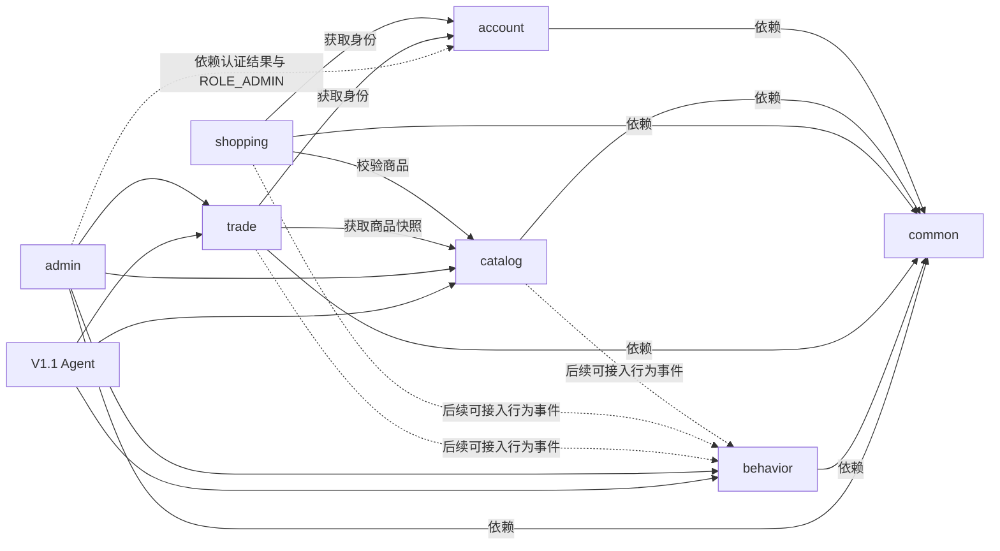

| 调用方 | 被调用方 | 原因 |
|---|---|---|
| shopping | account | 识别当前用户 |
| shopping | catalog | 校验商品和 SKU |
| trade | account | 获取当前用户身份和收货地址快照 |
| trade | catalog | 获取商品与 SKU 快照 |
| catalog | behavior | 后续 behavior API 确认后，可接入搜索和浏览事件发布 |
| shopping | behavior | 后续 behavior API 确认后，可接入收藏、取消收藏和加购事件发布 |
| trade | behavior | 后续 behavior API 确认后，可接入购买事件发布 |
| admin | account | 仅使用认证结果和 `ROLE_ADMIN`，不调用账户管理能力 |
| admin | catalog / trade / behavior | 提供管理员 HTTP 入口并调用已有业务能力 |
| Agent | catalog / trade / behavior | 查询商品、订单和行为数据 |

---

## 7. Java 包结构与访问规则

每个业务包按需要使用以下结构：

```text
模块/
├── api/             # 对其他模块公开的 Java 接口和模型
├── controller/      # HTTP 接口
├── service/         # 业务用例与事务
├── mapper/          # 本模块数据库访问
├── entity/          # 本模块数据库实体
├── dto/             # HTTP 请求参数
├── vo/              # HTTP 返回结果
├── event/           # 本模块产生的模块事件
└── config/          # 模块专用配置
```

允许：

```text
shopping 调用 catalog.api
trade 调用 catalog.api
后续如果支持从购物车结算，trade 可调用确认后的 shopping.api
behavior API 确认后，业务模块可调用 behavior.api.BehaviorEventPublisher
Controller 调用本模块 Service
Service 调用本模块 Mapper
```

禁止：

```text
trade 直接调用 catalog.mapper
trade 直接导入 catalog.entity
shopping 直接查询 product_sku 表
一个 Controller 调用另一个 Controller
behavior 反向控制订单或购物车
common 引用具体业务模块
admin 复制其他模块的 Service 逻辑
```

跨模块接口原则：

- 跨模块只使用 `api` 包；
- `api` 包中不能暴露数据库 Entity；
- 使用专门的跨模块请求和返回模型；
- 方法必须表达业务含义，不能只暴露通用 CRUD；
- 发现约定缺失时，先修改 `module-contracts.md`，不能直接临时调用 Mapper。

---

## 8. 模块公开能力

account、catalog、shopping、trade 的 V1.0 对外能力已经在 `module-contracts.md` 和对应模块文档中确定。behavior 相关能力仍是待后续模块设计确认的草案。

| 提供模块 | 公开能力 | 主要使用者 | 状态 |
|---|---|---|---|
| account | `CurrentUserProvider.requireCurrentUser()` | shopping、trade | 已确定 |
| account | `AddressQueryApi.requireOwnedAddress(userId, addressId)` | trade | 已确定 |
| catalog | `ProductQueryApi.requireSellableSku(skuId)` | shopping、trade | 已确定 |
| catalog | `ProductQueryApi.requireSellableSkus(skuIds)` | shopping、trade | 已确定 |
| shopping | CartQueryApi / CartCheckoutApi / CartItemSnapshot | trade | V1.0 暂不提供，后续如支持从购物车结算再确认 |
| trade | 对 behavior / admin / Agent 的订单查询 Java API | behavior、admin、Agent | V1.0 暂不提供，后续按真实调用方再确认 |
| behavior | 发布行为事件 | catalog、shopping、trade | 草案 |
| behavior | 查询行为记录和兴趣数据 | admin、Agent | 草案 |

`CurrentUserProvider.requireCurrentUser()` 的返回模型只包含 `userId` 和 `roles`。前端 `/api/users/me` 可以返回 username，但这是 account HTTP 接口自身查询结果，不属于跨模块 Java 约定。

account V1.0 明确不提供：

```txt
通用 UserQueryApi
UserSummary
管理员封号接口
管理员修改他人资料或密码接口
角色分配接口
```

---

## 9. 核心数据关系

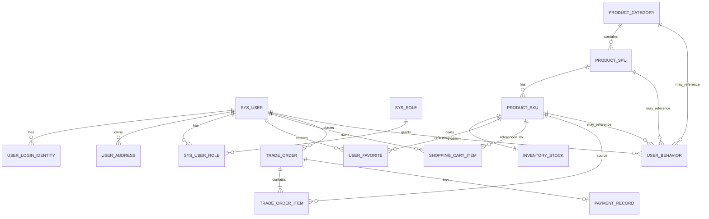

| 表 | 所属模块 | 其他模块如何使用 |
|---|---|---|
| `sys_user` | account | shopping/trade 通过 account API 获取当前身份，不直接读表 |
| `user_login_identity` | account | 仅 account 用于登录身份与 userId 映射 |
| `sys_role` | account | 由 account 与 Spring Security 用于角色校验 |
| `sys_user_role` | account | 由 account 与 Spring Security 用于角色校验 |
| `user_address` | account | trade 通过 AddressQueryApi 获取地址快照 |
| `product_category` | catalog | 通过 catalog API |
| `product_spu` | catalog | 通过 catalog API |
| `product_sku` | catalog | 通过 catalog API |
| `user_favorite` | shopping | 仅 shopping 直接读写 |
| `shopping_cart_item` | shopping | 仅 shopping 直接读写；V1.0 trade 不依赖 shopping |
| `inventory_stock` | trade | catalog 不直接读取或修改真实库存；下单库存校验由 trade 负责 |
| `trade_order` | trade | 通过 trade API |
| `trade_order_item` | trade | 通过 trade API |
| `payment_record` | trade | 通过 trade API |
| `user_behavior` | behavior | admin/Agent 通过 behavior API |
| `mq_consume_log` | behavior | 仅 behavior/messaging 使用 |

数据规范：

- 业务主键使用 `BIGINT`；
- 行为事件 ID 使用 UUID 字符串；
- 金额：Java 使用 `BigDecimal`，MySQL 使用 `DECIMAL`；
- 时间统一保存为 UTC 或明确约定的数据库时区；
- 订单项保存商品快照，不依赖商品当前值；
- 跨模块表关系以逻辑关联为主，不要求全部建立物理外键；
- 唯一约束用于保证收藏、购物车和消息幂等。

---

## 10. 关键业务流程

### 10.1 登录流程

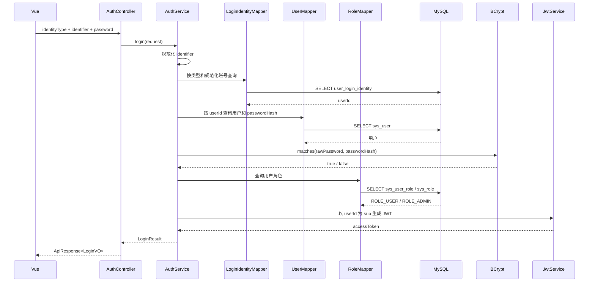

JWT 中只放 `userId`、角色和签发信息，不放密码、完整地址或展示资料。

### 10.2 商品搜索与详情流程

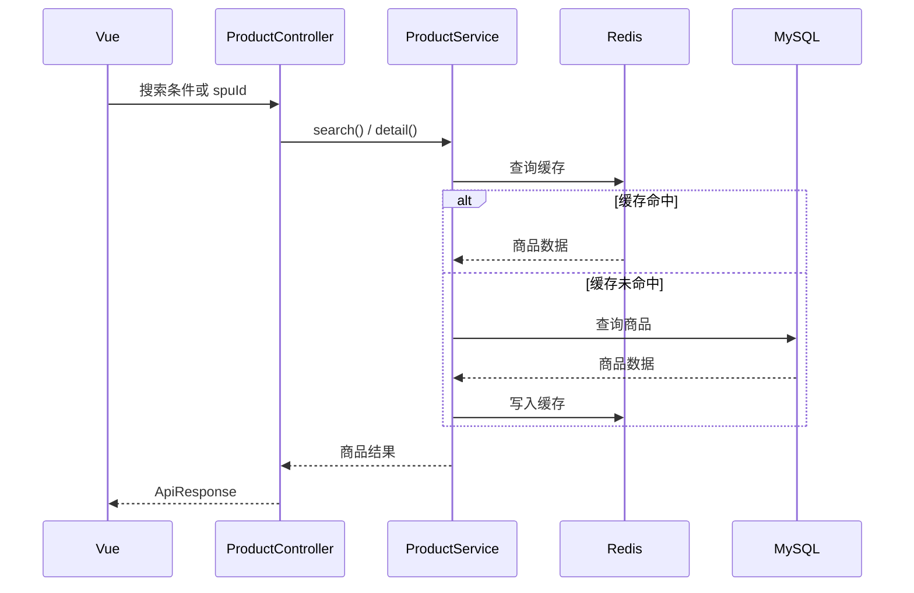

catalog 当前阶段只提供 keyword 查询和商品详情能力，不实现行为落库或 RabbitMQ 发布。后续 behavior API 确认后，可以在搜索和浏览场景接入事件发布。

### 10.3 收藏与购物车流程

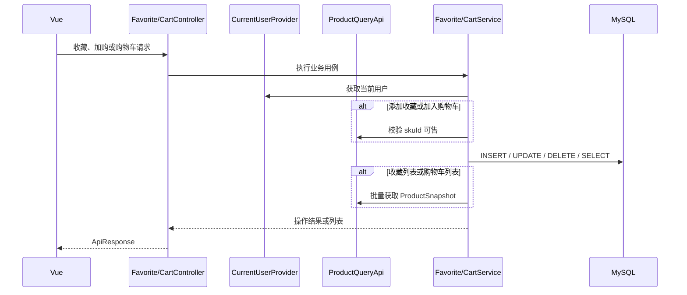

### 10.4 创建订单流程

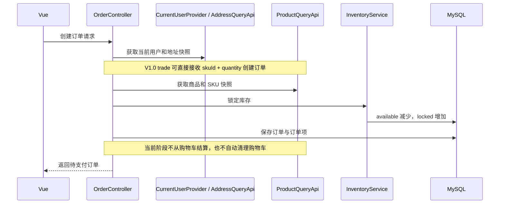

事务边界由 trade 的订单应用服务负责。订单、订单项和库存锁定必须保持一致。

### 10.5 行为消息流程

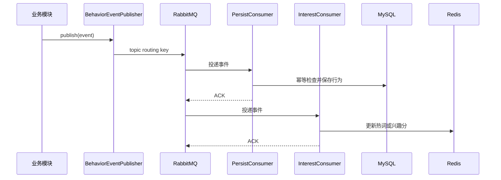

---

## 11. 状态机

### 11.1 订单状态机

V1.0 订单状态固定为：

```text
10 = PENDING_PAYMENT
20 = PAID
30 = CANCELED
```

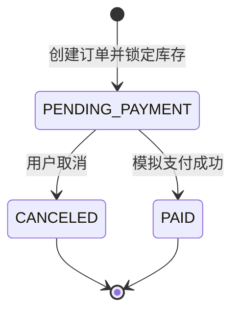

禁止：

```text
PAID -> CANCELED
PAID -> PAID
CANCELED -> PAID
CANCELED -> CANCELED
PAID -> PENDING_PAYMENT
CANCELED -> PENDING_PAYMENT
```

### 11.2 库存生命周期

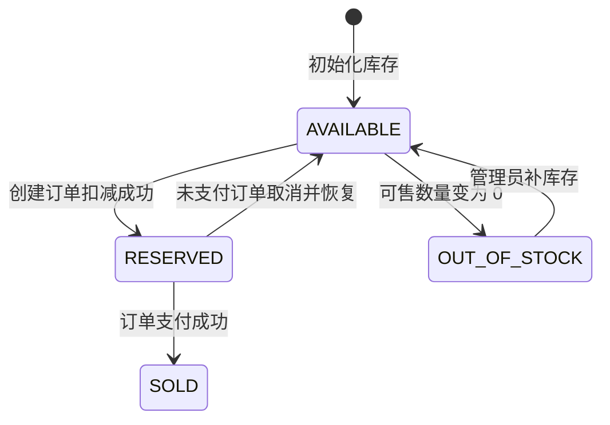

数据库中不必真的保存上述全部状态。实际以可售库存数量和版本号为准，这张图用于解释库存生命周期。

### 11.3 商品状态机

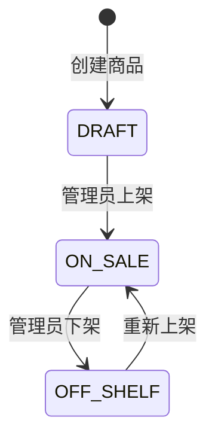

只有 `ON_SALE` 商品允许加入购物车和下单。

---

## 12. Redis 设计范围

当前 V1.0 已实现的 catalog Redis 缓存只包括商品详情：

| Key | 数据结构 | 作用 |
|---|---|---|
| `catalog:product:detail:{spuId}` | String / JSON | 商品详情缓存，TTL 1 小时 |

分类树缓存暂不实现。搜索热词和用户近期兴趣属于后续 behavior 模块，不在 catalog 当前实现范围。

后续 behavior 的行为权重初始约定：

```text
SEARCH            +2
VIEW              +1
FAVORITE          +4
ADD_TO_CART       +6
PURCHASE         +10
NEGATIVE_FEEDBACK -5
```

行为字段和事件落库在 behavior 模块文档中确认；catalog 当前不发布 RabbitMQ 行为事件。

V1.0 不实现服务端 Token 黑名单和 Refresh Token；前端退出时只删除本地 Token。

---

## 13. RabbitMQ 设计范围

Exchange：

```text
commerce.behavior.exchange
```

类型：

```text
topic
```

Routing Key：

```text
behavior.search
behavior.view
behavior.favorite
behavior.cart
behavior.purchase
behavior.negative
```

Queue：

```text
behavior.persist.queue
behavior.interest.queue
behavior.dead.queue
```

统一事件信封：

```json
{
  "eventId": "uuid",
  "eventType": "SEARCH",
  "source": "persona-commerce-server",
  "occurredAt": "2026-06-26T12:00:00Z",
  "traceId": "uuid",
  "version": "1.0",
  "payload": {}
}
```

精确 payload、重试次数、死信条件和幂等键在 `event-contract.md` 中确定。

---

## 14. HTTP API 范围

本节只确定接口范围，不代表 DTO、VO 和错误码已经完成。
统一响应中的 `ApiResponse.code` 保持 `int`；字符串业务错误码使用 `errorCode` 表示，例如 `ACCOUNT_USERNAME_EXISTS`、`ACCOUNT_UNAUTHORIZED`。

当前 SecurityConfig 规则：

```text
/api/auth/register 匿名
/api/auth/login 匿名
/api/catalog/** 匿名
/actuator/health 匿名
/api/admin/** 需要 ROLE_ADMIN
/api/shopping/** 默认需要认证
/api/trade/** 默认需要认证
其他接口默认需要认证
```

### account

```http
POST /api/auth/register
POST /api/auth/login

GET   /api/users/me
PATCH /api/users/me
PUT   /api/users/me/password

GET    /api/users/me/addresses
POST   /api/users/me/addresses
PUT    /api/users/me/addresses/{addressId}
DELETE /api/users/me/addresses/{addressId}
PUT    /api/users/me/addresses/{addressId}/default
```

V1.0 不提供服务端 logout 接口。前端退出时删除本地 JWT。

### catalog

```http
GET /api/catalog/categories
GET /api/catalog/products
GET /api/catalog/products/{spuId}
GET /api/catalog/skus/{skuId}
```

catalog 浏览接口允许匿名访问。收藏、购物车、下单等用户行为接口由后续模块要求登录。

### shopping

```http
POST   /api/shopping/favorites/{skuId}
DELETE /api/shopping/favorites/{skuId}
GET    /api/shopping/favorites

POST   /api/shopping/cart/items
PATCH  /api/shopping/cart/items/{cartItemId}
DELETE /api/shopping/cart/items/{cartItemId}
DELETE /api/shopping/cart/items
GET    /api/shopping/cart/items
```

### trade

```http
POST /api/trade/orders
GET  /api/trade/orders
GET  /api/trade/orders/{orderId}
POST /api/trade/orders/{orderId}/cancel
POST /api/trade/orders/{orderId}/pay
```

### admin

```http
POST  /api/admin/products
PATCH /api/admin/products/{spuId}
PATCH /api/admin/products/{spuId}/status
PATCH /api/admin/stocks/{skuId}
GET   /api/admin/orders
GET   /api/admin/behaviors
```

真正可交给 Codex 的接口约定必须在 `api-contract.md` 中写清：

- 是否需要登录；
- 角色要求；
- Path、Query 和 Body 参数；
- 请求 DTO；
- 返回 VO；
- 成功示例；
- 失败示例；
- 业务错误码；
- 分页结构；
- 幂等要求。

---

## 15. 前端页面范围

用户端：

```text
登录页
商品首页
商品搜索页
商品详情页
收藏页
购物车页
确认订单页
订单列表页
订单详情页
收货地址页
```

管理端：

```text
商品管理页
库存管理页
订单查询页
用户行为查询页
```

前端目标是完成主链路和联调，不追求复杂视觉设计。

---

## 16. 技术栈与项目深度

Java 后端：

- Java 17；
- Spring Boot 3.x；
- Spring MVC；
- Spring Security；
- JWT；
- BCrypt；
- MyBatis-Plus；
- Spring Validation；
- Spring Data Redis；
- Spring AMQP；
- Flyway；
- MySQL Driver；
- Actuator；
- JUnit 5；
- Mockito。

前端：

- Vue 3；
- TypeScript；
- Vite；
- Vue Router；
- Pinia；
- Axios；
- Element Plus。

基础设施：

- MySQL 8.4；
- Redis 7.4；
- RabbitMQ 4 Management；
- Docker Compose。

项目主要展示点：

- 模块化单体与模块边界；
- Spring Security + JWT；
- 数据库迁移与 MyBatis-Plus；
- Redis 缓存与 Sorted Set；
- RabbitMQ ACK、重试、死信和幂等；
- 事务、乐观锁和防超卖；
- 订单快照、状态机和幂等支付；
- 前后端联调与自动化测试；
- 行为数据为 Agent 提供上下文。

---

## 17. V1.1 Agent 接入边界

Agent 不直接查询其他模块 Mapper，也不直接操作数据库表。

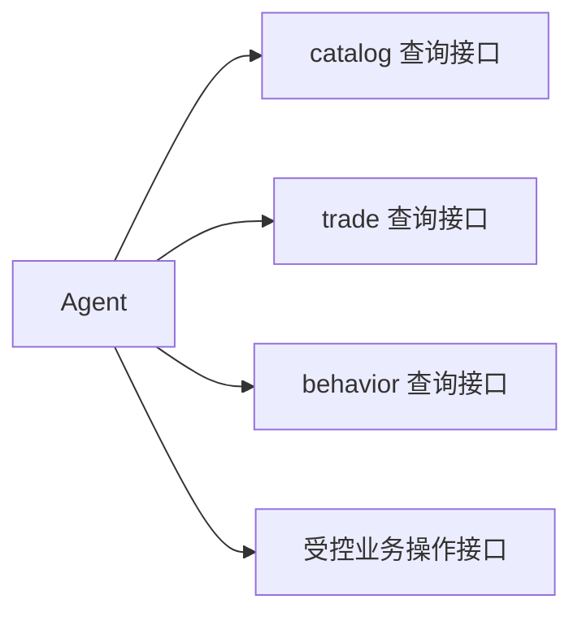

V1.1 可以在 V1.0 基础上实现：

- 用户兴趣总结 Agent；
- 商品推荐 Agent；
- 购物决策辅助 Agent；
- 管理端行为分析 Agent；
- Agent 间的受控消息协作。

Agent 只能调用明确授权的公开接口。涉及下单、取消订单等写操作时，仍必须经过原业务 Service 的校验和事务。

---

## 18. 设计与开发顺序

### 18.1 总体基线

业务编码前先确定：

```text
v1.0-architecture.md
module-contracts.md 的通用调用规则
当前准备实现模块的详细技术文档
```

不要求在 account 开工前写完 catalog、shopping、trade 和 behavior 的全部详细文档。

### 18.2 逐模块设计与开发

```text
1. common 技术基础
2. account 账户与认证
3. catalog 商品目录
4. shopping 收藏与购物车
5. trade 库存、订单与模拟支付
6. behavior 行为事件与消息
7. admin 最小管理入口
8. 前端完整联调
9. 测试、演示数据和 V1.0 发布
```

### 18.3 每个模块的固定流程

```text
需求与边界说明
→ 数据库与 HTTP 接口设计
→ 跨模块 Java 约定
→ 时序图和状态图
→ 技术知识教学
→ 形成 Codex 任务
→ Codex 分阶段实现
→ 代码审查
→ 运行与测试
→ 手动修改一个小需求
→ Git 提交
```

### 18.4 account 当前开工条件

account 已经具备：

```text
总体架构边界
module-contracts.md 中的精确对外约定
modules/01-account.md 中的表、HTTP 接口、类清单、错误码和测试标准
```

因此 account 可以进入 Codex 实现，不需要先写完其他业务模块文档。

### 18.5 Codex 固定约束

account 实现必须先阅读：

```text
AGENTS.md
docs/v1.0-architecture.md
docs/module-contracts.md
docs/modules/01-account.md
persona-commerce-server/pom.xml
persona-commerce-server/src/
```

任务中固定写明：

```text
不得自行修改已经确定的接口、数据模型和模块边界。
不得实现封号、角色管理、邮箱登录、手机号登录身份、短信验证码、OAuth、Refresh Token 或服务端 Token 黑名单。
不得让 admin 修改账户。
account 阶段不得新增生产环境 admin 业务 Controller；ROLE_ADMIN 权限规则只能通过测试专用端点或 Security 配置测试验证。
发现设计冲突或缺失时，停止实现并报告，不得自行发明另一套方案。
只修改当前任务允许的文件范围。
完成后运行测试，并汇报修改文件、测试结果和未解决问题。
```

---

## 19. V1.0 完成标准

业务链路：

```text
用户登录
→ 搜索商品
→ 查看详情
→ 收藏或加入购物车
→ 创建订单
→ 扣减库存
→ 模拟支付
→ 查看订单
```

行为链路：

```text
业务行为产生
→ RabbitMQ
→ MySQL 存在行为记录
→ Redis 存在热词或兴趣分
```

工程标准：

- Spring Boot 可以启动；
- Vue 可以构建和运行；
- MySQL、Redis、RabbitMQ 连接正常；
- Flyway 可以从空数据库初始化 account 表、ROLE_USER、ROLE_ADMIN、一个普通演示用户和一个管理员演示用户；
- 核心接口存在基本自动化测试；
- 正确密码、错误密码和无 Token 场景可验证；
- 商品缓存可以验证命中与失效；
- 并发库存不能扣成负数；
- 重复支付和重复取消不会重复改变状态；
- RabbitMQ 消费失败可以进入重试或死信；
- 同一行为事件不会重复落库；
- 初始化演示数据可重复导入；
- README 反映 V1.0 当前状态；
- Git 标签 `v1.0.0` 创建完成。

---

## 20. 当前设计状态

已确定：

```txt
V1.0 项目范围
模块化单体
5 个业务模块
V1.0 Java 包的归属
模块总体依赖关系
数据归属原则
关键业务链路
订单、库存和商品状态图
MySQL、Redis、RabbitMQ 的职责
V1.1 Agent 接入边界
开发与学习流程
account 内部身份与外部登录身份的映射
account 五张表的归属
account HTTP 接口范围
CurrentUserProvider
AddressQueryApi
admin 与 account 的权限边界
account 错误范围和测试标准
```

account 已明确不做：

```txt
封号和解封
管理员修改账户
角色管理
邮箱登录和手机号登录身份
短信验证码
OAuth
Refresh Token
服务端 Token 黑名单
通用 UserQueryApi
UserSummary
```

仍待后续模块设计确定：

```txt
catalog、shopping、trade、behavior 的精确数据库字段和索引
shopping、trade、behavior 的跨模块 Java 方法签名
后续模块 HTTP DTO、VO 和错误码
RabbitMQ 各事件 payload
Redis TTL 与缓存失效策略
后续模块内部类清单和测试明细
```

下一步：

```txt
把同步后的 v1.0-architecture.md 与另外两份 account 文档提交 Git
在仓库根目录启动 Codex
先让 Codex 阅读项目并输出 account 分阶段实施计划
确认计划后开始实现 account
```
