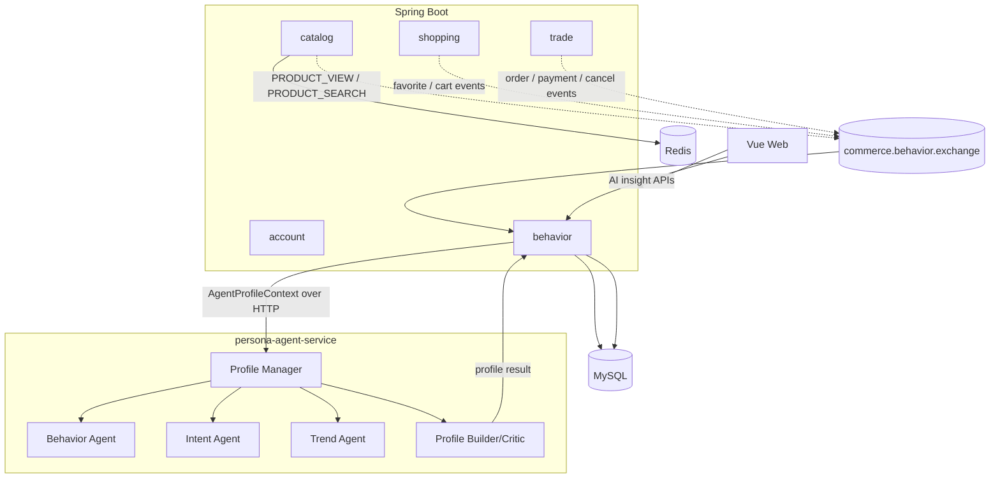

# PersonaFlow Commerce V1.1 架构说明

> 状态：completed  
> 版本：V1.1.0  
> 项目定位：基于 Spring Boot + RabbitMQ + FastAPI 的电商行为事件驱动用户画像系统  
> 更新时间：2026-06-30

## 1. 文档目的

本文记录 PersonaFlow Commerce V1.1 的已完成架构、模块边界、消息链路、Java 与 Python Agent 协作方式、前端展示范围和当前未实现能力。

V1.1 不重做 V1.0 的 account、catalog、shopping、trade 主链路，而是在主链路产生业务事实之后，补充行为事件采集、RabbitMQ 消费落库、画像上下文生成、规则版 Python Profile Agent Team 和 Vue AI 购物洞察页面。

## 2. V1.1 完成能力

V1.1 已完成：

- behavior 行为事件表、消费日志表、画像版本表；
- RabbitMQ behavior 行为事件总线；
- 手动 ACK、基础重试、死信队列、consume log；
- `eventId` 幂等落库；
- catalog / shopping / trade 行为事件发布；
- 当前用户行为查询、行为摘要和 AgentProfileContext；
- Python `persona-agent-service`；
- FastAPI `GET /health`；
- FastAPI `POST /agent/profile/build`；
- 规则版 Profile Agent Team；
- Java 后端真实调用 Python Agent；
- `user_profile_version` 画像版本保存；
- Vue `/ai-insights` AI 购物洞察页面。

## 3. V1.0 与 V1.1 的关系

| 维度 | V1.0 | V1.1 |
|---|---|---|
| 项目定位 | 电商主链路 | 电商主链路 + 行为事件 + 画像系统 |
| RabbitMQ | 基础设施可用 | behavior 行为事件总线已接入 |
| behavior | 不实现 | 行为事件落库、查询、摘要、画像上下文 |
| Python Agent | 不实现 | 规则版 Profile Agent Team |
| 用户画像 | 不实现 | 画像版本化保存与前端展示 |
| 前端 | 电商页面 | 增加 AI 购物洞察页 |

## 4. 总体架构



说明：

- Java 主链路仍负责权限、事务、库存、订单和行为事实发布。
- RabbitMQ 只承载 behavior 行为事件，不参与订单事务提交。
- Python Agent 不直接访问 MySQL，不绕过 Java 权限。
- 当前画像刷新链路使用 Java HTTP 调用 Python `POST /agent/profile/build`。
- Python 侧保留 Agent 消息协议和 `commerce.agent.exchange` 拓扑能力，但当前页面画像刷新不是异步 Agent 总线链路。

## 5. behavior 行为事件链路

```text
catalog / shopping / trade
-> RabbitBehaviorEventPublisher
-> commerce.behavior.exchange
-> behavior.persist.queue
-> BehaviorEventConsumer
-> behavior_event
-> behavior_consume_log
```

已实现能力：

- topic exchange：`commerce.behavior.exchange`；
- 队列：`behavior.persist.queue`；
- 死信队列：`behavior.dead.queue`；
- routing key 覆盖商品浏览、搜索、收藏、购物车、订单、支付、取消；
- 消息持久化；
- 手动 ACK；
- 基础重试；
- 多次失败进入死信队列；
- consume log 记录 PROCESSING / SUCCESS / FAILED；
- `eventId` 保证行为事件幂等落库；
- 同一 `messageId` 重复消费可被识别。

## 6. 行为事件发布边界

catalog 发布：

- `PRODUCT_VIEW`
- `PRODUCT_SEARCH`

shopping 发布：

- `FAVORITE_ADD`
- `FAVORITE_REMOVE`
- `CART_ADD`
- `CART_REMOVE`
- `CART_CLEAR`

trade 发布：

- `ORDER_CREATED`
- `PAYMENT_SUCCESS`
- `ORDER_CANCELED`

发布原则：

- 行为事件描述已经发生的事实；
- 发布失败不回滚主业务；
- behavior 不反向修改商品、购物车、订单、库存或支付状态；
- 行为 payload 不保存密码、JWT、收货人手机号、完整收货地址等敏感数据。

## 7. AgentProfileContext

Java behavior 模块生成结构化画像上下文，供 Python Agent 使用。

核心字段：

- `userId`
- `recentEvents`
- `eventTypeCounts`
- `recentKeywords`
- `topCategories`
- `viewedProducts`
- `cartSignals`
- `orderSignals`
- `paidSignals`
- `canceledSignals`
- `fulfilledNeeds`
- `evidenceEventIds`
- `generatedAt`

`PAYMENT_SUCCESS` 在上下文中被确定性标记为：

- `preferenceConfirmed = true`
- `fulfilled = true`
- `complementTrigger = true`

这意味着成交 SKU / SPU 进入已满足需求，短期不应重复推荐同一商品，而应作为配套需求和相邻场景探索的证据。

## 8. Python Agent 服务

`persona-agent-service` 是独立 FastAPI 服务。

已实现接口：

```http
GET  /health
POST /agent/profile/build
```

当前 Agent 是规则版 Profile Agent Team：

- Profile Manager
- Behavior Agent
- Intent Agent
- Trend Agent
- Profile Builder/Critic

它不调用真实 LLM，不接 OpenAI / Claude，不使用 LangChain，不做 RAG，不做真实推荐算法。

## 9. Java 与 Python 调用链路

```text
POST /api/behavior/me/profile/refresh
-> CurrentUserProvider.requireCurrentUser()
-> BehaviorContextService.buildAgentProfileContext(userId, days)
-> HttpAgentProfileClient
-> POST http://127.0.0.1:8001/agent/profile/build
-> Python Profile Agent Team
-> AgentProfileBuildResponse
-> user_profile_version
```

异常处理：

- Python Agent 不可用时，Java 返回 `AGENT_SERVICE_UNAVAILABLE`；
- 前端显示错误提示；
- 页面不白屏；
- 其他电商主链路不受影响。

## 10. V1.1 HTTP 接口

Java behavior 当前用户接口：

```http
GET  /api/behavior/me/events?limit=20&eventType=PRODUCT_VIEW
GET  /api/behavior/me/summary?days=30
GET  /api/behavior/me/agent-context?days=30
GET  /api/behavior/me/profile/latest
POST /api/behavior/me/profile/refresh?days=30
```

规则：

- 全部需要登录；
- Controller 不接收 `userId`；
- 只能查询当前用户；
- 不新增 admin 行为查询；
- 不暴露 JWT、密码、完整地址、收货人手机号。

## 11. 前端 AI 购物洞察

Vue 前端新增：

```text
/ai-insights
```

页面展示：

- latest profile；
- 画像摘要；
- fulfilledNeeds；
- complementOpportunities；
- doNotRecommend；
- 行为摘要 eventTypeCounts；
- 最近行为 recentEvents；
- evidence / evidenceEventIds；
- Agent 不可用错误。

前端只调用 Java 后端，不直接访问 Python Agent。

## 12. 数据表

V1.1 新增 Flyway migration：

```text
V5__create_behavior_tables.sql
```

新增表：

- `behavior_event`
- `behavior_consume_log`
- `user_profile_version`

未新增：

- `profile_task`
- `profile_artifact`
- Outbox 表
- 推荐结果表

## 13. 当前未实现

V1.1 没有实现：

- 真实支付；
- 退款；
- 物流；
- 优惠券；
- admin 管理后台；
- 真实推荐算法；
- 真实 LLM；
- RAG；
- Outbox；
- 分布式事务；
- Agent 直接下单；
- Agent 直接修改业务状态；
- Agent 直接访问业务数据库；
- 生产级高并发压测。

## 14. 验证结果

当前已验证：

- Java 后端：219 tests passed；
- Python Agent：21 pytest passed；
- Vue 前端：`npm.cmd run build` passed；
- Python `/health` UP；
- Java `/actuator/health` UP；
- db / rabbit / redis UP；
- `/api/behavior/me/profile/refresh` 能真实调用 Python；
- `/api/behavior/me/profile/latest` 能查到画像；
- `/ai-insights` 能展示 latest profile、fulfilledNeeds、complementOpportunities、doNotRecommend；
- Python Agent 停止时刷新画像返回 `AGENT_SERVICE_UNAVAILABLE`，页面不白屏。

## 15. 结论

V1.1 已从纯电商主链路扩展为可演示的“行为事件驱动用户画像系统”。当前重点不是生产级推荐算法，而是展示清晰的业务链路、可靠事件消费、画像上下文建模、Java/Python 协作和可解释前端展示。
