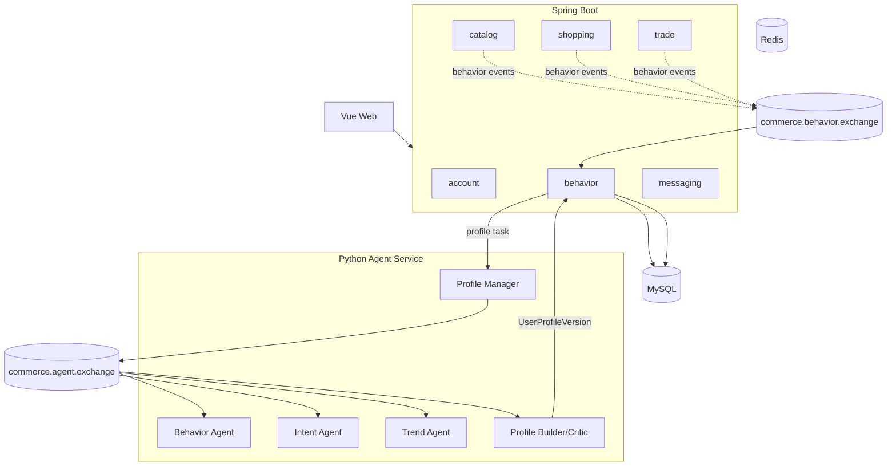

# PersonaFlow Commerce V1.1 架构设计

> 状态：设计中  
> 目标版本：V1.1.0  
> 项目定位：在 V1.0 电商主链路上增加行为事件流、RabbitMQ 消息通信、多 Agent 用户画像和 AI 购物洞察展示  
> 更新时间：2026-06-29

## 1. 文档目的

本文定义 V1.1 的总体架构、模块边界、消息链路、Agent 服务边界和实施阶段。

V1.1 不重做 V1.0 的 account、catalog、shopping、trade 主链路，而是在这些主链路产生业务事实之后，补充行为事件、消息总线、用户画像和前端 AI 洞察。

## 2. V1.1 项目定位

V1.1 的定位是把 V1.0 从“可演示的纯电商平台”扩展为“具备行为事件流和多 Agent 用户画像能力的 AI 电商项目”。

新增能力：

- 用户行为事件流；
- RabbitMQ 行为事件总线；
- RabbitMQ Agent 任务通信总线；
- Python Profile Agent Team；
- 用户画像版本；
- 前端 AI 购物洞察展示。

## 3. V1.1 和 V1.0 的区别

| 维度 | V1.0 | V1.1 |
|---|---|---|
| 项目定位 | 纯电商主链路 | 电商主链路 + 行为事件 + Agent 画像 |
| RabbitMQ | 仅基础设施准备 | 行为事件总线和 Agent 任务总线 |
| behavior | 不实现 | 新增行为事件落库和查询 |
| Agent | 不实现 | 新增 Python Profile Agent Team |
| 用户画像 | 不实现 | 新增画像版本和 AI 洞察 |
| 前端 | 电商演示页面 | 增加 AI 购物洞察页面 |

## 4. 总体架构图



## 5. 两条 RabbitMQ 链路

### 5.1 行为事件链路

```text
catalog / shopping / trade
-> commerce.behavior.exchange
-> behavior.persist.queue
-> behavior_event
```

用途：

- 业务模块发布用户行为事实；
- behavior 模块消费并落库；
- 为后续用户画像准备结构化上下文。

### 5.2 Agent 任务通信链路

```text
Profile Manager
-> commerce.agent.exchange
-> Behavior Agent / Intent Agent / Trend Agent / Profile Builder-Critic
-> Artifact
-> user_profile_version
```

用途：

- Profile Manager 分发画像工作流任务；
- Agent 之间交换结构化 Artifact、挑战、返工和完成状态；
- 最终生成用户画像版本。

RabbitMQ 在 V1.1 同时服务两类通信：业务行为事件和 Agent 任务协作。两类消息使用不同 exchange，避免业务事件和 Agent 内部工作流耦合。

## 6. Java 后端新增模块

V1.1 Java 后端新增：

- `behavior`：行为事件模型、事件落库、行为查询、用户画像版本保存、Agent 上下文准备；
- `messaging`：RabbitMQ exchange、queue、binding、生产者、消费者、ACK、重试、死信和幂等处理。

已完成模块只接入事件发布点：

- catalog 发布 `PRODUCT_VIEW`、`PRODUCT_SEARCH`；
- shopping 发布 `FAVORITE_ADD`、`FAVORITE_REMOVE`、`CART_ADD`、`CART_REMOVE`、`CART_CLEAR`；
- trade 发布 `ORDER_CREATED`、`PAYMENT_SUCCESS`、`ORDER_CANCELED`。

事件发布失败不回滚主业务。

## 7. Python Agent 服务

V1.1 新增独立 Python Agent 服务，包含：

- Profile Manager；
- Behavior Agent；
- Intent Agent；
- Trend Agent；
- Profile Builder/Critic。

Python Agent 不直接查询业务数据库，不绕过 Java 后端权限控制。Java 后端负责准备结构化上下文，Agent 输出结构化 Artifact。

## 8. 前端新增页面

V1.1 前端新增 AI 购物洞察展示页面，建议包括：

- 当前用户画像摘要；
- 长期偏好；
- 当前购买意图；
- 已满足需求；
- 互补推荐机会；
- 最近行为解释；
- 画像版本更新时间。

前端只展示 Java 后端提供的数据，不直接访问 Python Agent 服务。

## 9. 数据表变化

V1.1 计划新增表：

- `behavior_event`：保存用户行为事件；
- `behavior_consume_log`：保存消息消费幂等记录；
- `user_profile_version`：保存用户画像版本；
- `profile_task`：可选，保存画像任务状态；
- `profile_artifact`：可选，保存 Agent 中间 Artifact。

V1.0 表结构不需要迁移或重建。V1.1 通过新增 Flyway migration 扩展。

## 10. API 变化

V1.1 计划新增 HTTP 能力：

- 查询当前用户行为摘要；
- 查询当前用户最新画像；
- 查询当前用户 AI 购物洞察；
- 触发或刷新当前用户画像任务。

精确路径和 DTO 在 behavior 模块实现前确认。V1.1 不新增 admin 管理后台。

## 11. 不做什么

V1.1 不实现：

- 真实支付、退款、物流、售后；
- 优惠券、满减、秒杀；
- 店铺系统、商家系统、多商家拆单；
- admin 管理后台；
- RAG；
- 自动营销；
- Agent 直接下单或直接修改业务状态；
- Agent 直接访问业务数据库；
- 用 Agent 替代 Java 后端的权限、事务和业务校验。

## 12. PAYMENT_SUCCESS 语义

`PAYMENT_SUCCESS` 是画像中的强信号，但它不表示继续推荐当前已购买商品。

它同时表示：

- 偏好确认；
- 当前具体需求满足；
- 互补需求触发。

成交后推荐逻辑应该降低同一 SKU / SPU 的短期推荐权重，转向配件、耗材、补充服务、复购周期或相邻场景需求。

## 13. 分阶段施工计划

### 阶段 0：文档收口

- 新增 V1.1 总体架构文档；
- 新增 behavior 模块文档；
- 新增 RabbitMQ 行为事件与 Agent 总线文档；
- 新增 Profile Agent Team 文档；
- 更新 module-contracts、V1.0 架构、README 和架构历史。

### 阶段 1：behavior 表、Entity、Mapper

- 新增 `behavior_event`；
- 新增消费幂等表；
- 新增用户画像版本表；
- 不接入业务模块发布。

### 阶段 2：RabbitMQ 行为事件总线

- 创建 `commerce.behavior.exchange`；
- 创建 `behavior.persist.queue`、`behavior.dead.queue`；
- 实现行为事件发布和消费落库；
- 接入 catalog / shopping / trade 事件发布点。

### 阶段 3：行为查询和画像上下文准备

- 查询用户近期行为；
- 生成 Agent 所需结构化上下文；
- 不实现 Agent 推理。

### 阶段 4：RabbitMQ Agent 任务总线

- 创建 `commerce.agent.exchange`；
- 定义 Agent 任务消息、Artifact 消息、返工消息；
- 实现基础任务分发和状态跟踪。

### 阶段 5：Python Profile Agent Team

- 实现 Profile Manager；
- 实现 Behavior Agent、Intent Agent、Trend Agent、Profile Builder/Critic；
- 生成结构化用户画像版本。

### 阶段 6：前端 AI 购物洞察

- 展示画像版本；
- 展示偏好、意图、满足状态和互补推荐机会；
- 展示可解释文本。

### 阶段 7：收尾和测试

- 文档同步；
- 全量测试；
- 本地演示流程更新。
