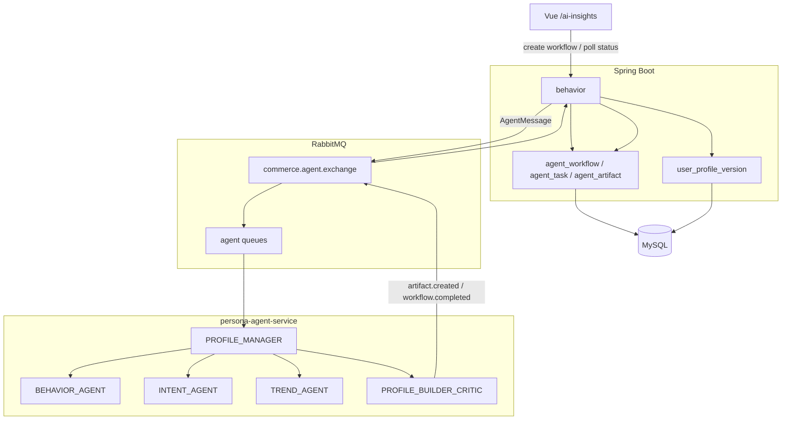

# PersonaFlow Commerce V1.2 架构说明

> 状态：planned  
> 版本目标：V1.2.0  
> 主题：异步 Profile Agent 工作流与 Artifact 追踪  
> 前置版本：V1.1 completed  
> 更新时间：2026-06-30

## 1. 文档目的

本文记录 PersonaFlow Commerce V1.2 的计划架构。V1.2 不扩展电商主业务，也不把项目包装成“AI 推荐商城”，而是在 V1.1 行为画像链路之上，把同步画像刷新升级为可追踪、可审计、可异步执行的 Profile Agent 工作流。

V1.2 重点展示：

- 异步 workflow；
- RabbitMQ Agent Bus；
- AgentMessage 消息约定；
- Agent Artifact 留痕；
- workflow / task 状态追踪；
- Profile Builder/Critic 审核；
- `PAYMENT_SUCCESS` 的需求满足与互补触发语义；
- 前端展示 workflow 状态与 Artifact 证据链。

## 2. V1.1 已完成基础

V1.1 已完成：

- V1.0 电商主链路；
- behavior event 行为事实；
- RabbitMQ behavior 总线；
- `behavior_event` 落库；
- `behavior_consume_log`；
- `AgentProfileContext`；
- Java 同步调用 Python Agent；
- `user_profile_version`；
- Vue `/ai-insights` AI 购物洞察页面。

当前画像刷新链路是同步模式：

```text
Vue 点击刷新画像
-> Java 构建 AgentProfileContext
-> Java HTTP 调用 Python /agent/profile/build
-> Python 规则版 Profile Agent Team 返回画像
-> Java 保存 user_profile_version
-> Vue 展示 latest profile
```

## 3. V1.2 目标

V1.2 计划将同步画像刷新升级为异步 workflow：

```text
Vue 创建画像 workflow
-> Java 创建 agent_workflow
-> Java 通过 commerce.agent.exchange 投递 AgentMessage
-> Python Profile Manager 编排 Behavior / Intent / Trend / Critic
-> 各 Agent 产出结构化 Artifact
-> Critic 审核画像草案和 PAYMENT_SUCCESS 语义
-> Java 保存 workflow / task / artifact
-> workflow 成功后发布 user_profile_version
-> Vue 展示 workflow 状态与 Artifact 留痕
```

V1.2 的核心价值不是“更复杂推荐”，而是让画像生成过程可解释：

- 一次画像 workflow 为什么成功或失败；
- 每个 Agent 产出了什么结构化结果；
- 哪些 eventId 支撑了画像结论；
- `PAYMENT_SUCCESS` 是否被正确解释为已满足需求；
- Critic 是否阻止了继续推荐已购买 SKU / SPU。

## 4. 非目标

V1.2 不实现：

- 真实 LLM；
- OpenAI / Claude 接入；
- LangChain；
- RAG；
- 向量数据库；
- 复杂推荐算法；
- 真实支付；
- 物流系统；
- 优惠券系统；
- 生产级高并发压测；
- 分布式事务；
- Outbox 完整可靠消息；
- admin 管理后台主线能力。

Admin Lite 可以作为后期展示增强，但不是 V1.2 主线。V1.2 主线是异步 Profile Agent workflow 和 Artifact 追踪。

## 5. 总体架构



## 6. 核心概念

| 概念 | 说明 |
|---|---|
| `agent_workflow` | 一次异步画像刷新工作流 |
| `agent_task` | workflow 内某个 Agent 的任务状态 |
| `agent_artifact` | Agent 产出的结构化中间结果 |
| `AgentMessage` | Java 与 Python Agent 之间的工作流消息 |
| `BehaviorFactReport` | Behavior Agent 输出的行为事实报告 |
| `IntentReport` | Intent Agent 输出的需求状态报告 |
| `TrendReport` | Trend Agent 输出的长期偏好与趋势报告 |
| `ProfileDraft` | Builder 生成的画像草稿 |
| `ProfileAuditReport` | Critic 对画像草稿的审核报告 |
| `UserProfileVersion` | Java 保存并面向前端展示的画像版本 |

## 7. 状态模型

### 7.1 agent_workflow

状态建议：

```text
PENDING
RUNNING
SUCCEEDED
FAILED
CANCELED
```

语义：

- `PENDING`：Java 已创建 workflow，但 Agent 尚未开始；
- `RUNNING`：至少一个 Agent task 正在处理；
- `SUCCEEDED`：画像生成成功，已保存 `user_profile_version`；
- `FAILED`：工作流失败，保留错误信息；
- `CANCELED`：预留状态，V1.2 可以不实现用户主动取消。

### 7.2 agent_task

状态建议：

```text
PENDING
RUNNING
SUCCEEDED
FAILED
SKIPPED
```

### 7.3 Agent role

```text
PROFILE_MANAGER
BEHAVIOR_AGENT
INTENT_AGENT
TREND_AGENT
PROFILE_BUILDER_CRITIC
```

## 8. 数据模型草案

### 8.1 agent_workflow

建议字段：

```text
id
workflow_id
user_id
status
trigger_type
context_days
current_step
error_code
error_message
started_at
completed_at
created_at
updated_at
```

约束：

- `workflow_id` 全局唯一；
- `user_id + created_at` 建索引；
- `status + created_at` 可建索引；
- 不保存密码、JWT、收货人手机号、完整收货地址。

### 8.2 agent_task

建议字段：

```text
id
workflow_id
task_id
agent_role
status
input_artifact_ids
output_artifact_ids
error_message
started_at
completed_at
created_at
updated_at
```

约束：

- `workflow_id + task_id` 唯一；
- `workflow_id + status` 建索引；
- `input_artifact_ids` / `output_artifact_ids` 可先用 JSON 字符串保存。

### 8.3 agent_artifact

建议字段：

```text
id
artifact_id
workflow_id
task_id
agent_role
artifact_type
artifact_json
evidence_event_ids
created_at
```

artifact type：

```text
BEHAVIOR_FACT_REPORT
INTENT_REPORT
TREND_REPORT
PROFILE_DRAFT
PROFILE_AUDIT_REPORT
USER_PROFILE_VERSION
```

约束：

- `artifact_id` 全局唯一；
- `workflow_id + created_at` 建索引；
- Artifact 只追加，不覆盖历史；
- `artifact_json` 保存结构化产物，不保存 prompt、密钥或敏感用户信息。

## 9. AgentMessage 草案

```text
messageId
workflowId
taskId
sender
receiver
messageType
artifactType
artifactId
correlationId
timestamp
payload
```

说明：

- `messageId` 用于消息追踪；
- `workflowId` 关联 Java workflow；
- `taskId` 关联具体 Agent task；
- `sender` / `receiver` 使用 Agent role；
- `messageType` 使用固定枚举；
- `payload` 只传结构化上下文、Artifact 或状态，不传敏感信息。

## 10. RabbitMQ Agent Bus 草案

Exchange：

```text
commerce.agent.exchange
```

类型：

```text
topic
```

Routing keys：

```text
agent.task.assigned
agent.artifact.created
agent.challenge.raised
agent.revision.requested
agent.revision.completed
agent.task.completed
agent.task.failed
agent.workflow.completed
```

建议队列：

```text
agent.profile-manager.queue
agent.behavior.queue
agent.intent.queue
agent.trend.queue
agent.profile-builder.queue
agent.dead.queue
```

详细消息约定见 [Agent 工作流消息总线](messaging/02-agent-workflow-bus.md)。

## 11. Java 后端职责

Java 在 V1.2 中负责：

- 当前用户认证与权限隔离；
- 构建 `AgentProfileContext`；
- 创建 `agent_workflow`；
- 投递 `AgentMessage` 到 `commerce.agent.exchange`；
- 接收 Python Agent 产生的 artifact / task / workflow 消息；
- 保存 `agent_task`；
- 保存 `agent_artifact`；
- workflow 成功后保存 `user_profile_version`；
- 给 Vue 提供 workflow 查询接口。

Java 不负责：

- 真实 Agent 推理；
- 真实 LLM 调用；
- 复杂推荐算法；
- 直接替 Python 管理内部 Agent 执行细节。

## 12. Python Agent 职责

Python Agent 在 V1.2 中负责：

- 消费 Agent task 消息；
- Profile Manager 编排规则版工作流；
- Behavior Agent 生成 `BehaviorFactReport`；
- Intent Agent 生成 `IntentReport`；
- Trend Agent 生成 `TrendReport`；
- Profile Builder/Critic 生成 `ProfileDraft` 和 `ProfileAuditReport`；
- 发布 `artifact.created`、`task.completed`、`task.failed`、`workflow.completed` 等消息。

Python Agent 不允许：

- 直接查询 Java 业务数据库；
- 直接修改订单、库存、购物车或支付状态；
- 绕过 Java 的当前用户权限；
- 保存 `user_profile_version` 到 MySQL。

## 13. HTTP 接口草案

### 13.1 创建异步画像 workflow

```http
POST /api/behavior/me/profile/workflows?days=30
```

返回示例：

```json
{
  "workflowId": "wf-xxx",
  "status": "PENDING",
  "createdAt": "2026-06-30T12:00:00"
}
```

要求：

- 必须登录；
- Controller 不接收 `userId`；
- 只能为当前用户创建 workflow；
- `days` 默认 30，最大 90。

### 13.2 查询 workflow 列表

```http
GET /api/behavior/me/profile/workflows
```

只返回当前用户自己的 workflow。

### 13.3 查询 workflow 详情

```http
GET /api/behavior/me/profile/workflows/{workflowId}
```

返回：

- workflow 状态；
- 当前步骤；
- task 列表；
- 错误信息；
- 创建时间；
- 完成时间。

### 13.4 查询 Artifact

```http
GET /api/behavior/me/profile/workflows/{workflowId}/artifacts
```

返回当前 workflow 下的结构化 Artifact。

### 13.5 V1.1 同步接口

V1.1 同步接口可以保留：

```http
POST /api/behavior/me/profile/refresh
```

文档表述应区分：

- V1.1 使用同步刷新；
- V1.2 新增异步 workflow 刷新。

## 14. 前端展示草案

在现有 `/ai-insights` 页面基础上计划新增：

- 画像刷新记录；
- workflow 状态；
- Agent 执行步骤；
- Artifact 展示；
- Critic 审核结果；
- 失败原因。

页面重点不是“猜你喜欢”，而是展示：

- 一次画像如何被 Agent Team 生成；
- 每个 Agent 产出了什么证据；
- Critic 为什么允许画像发布；
- 哪些需求已满足；
- 哪些 SKU / SPU 不再推荐；
- 哪些配套机会被生成。

## 15. PAYMENT_SUCCESS 审核规则

V1.2 继续沿用 V1.1 的核心语义：

```text
PAYMENT_SUCCESS = 偏好确认 + 当前需求满足 + 互补需求触发
```

Critic 必须检查：

- 是否错误地继续推荐 fulfilled SKU / SPU；
- fulfilledNeeds 是否进入 doNotRecommend；
- complementOpportunities 是否有 evidence；
- 画像是否存在无证据的强推断；
- `PAYMENT_SUCCESS` 是否被错误当成单纯正反馈。

## 16. 分阶段实施计划

### Phase 1：文档与模型设计

- 新增 V1.2 架构文档；
- 明确 workflow / task / artifact 模型；
- 明确 Agent Bus 消息约定；
- 明确接口草案。

### Phase 2：Java workflow 持久化

- 新增 `agent_workflow` / `agent_task` / `agent_artifact` 表；
- 实现 workflow 创建、查询、状态更新；
- 实现 Artifact 保存和查询。

### Phase 3：Java Agent Bus 投递

- 实现 Java 侧 AgentMessage publisher；
- 创建 workflow 后投递 `agent.task.assigned`；
- 不破坏 V1.1 同步刷新接口。

### Phase 4：Python Agent Bus 消费

- Python Profile Manager 消费 `agent.task.assigned`；
- 规则版执行 Behavior / Intent / Trend / Critic；
- 发布 `artifact.created` / `workflow.completed`。

### Phase 5：Java 消费 Agent 结果

- Java 消费 artifact / task / workflow 消息；
- 保存 Artifact；
- 更新 workflow 状态；
- 成功后保存 `user_profile_version`。

### Phase 6：前端 workflow 展示

- AI 购物洞察页展示 workflow 列表；
- 展示 task 状态；
- 展示 Artifact；
- 展示 Critic 审核结果。

### Phase 7：Admin Lite 后期增强

- 轻量商品 / SKU / 库存 / 图片 key 管理；
- 仅作为展示数据维护增强；
- 不影响 V1.2 主线。

## 17. 验收标准

V1.2 完成后应满足：

- 用户可以创建异步画像 workflow；
- workflowId 可查询；
- 前端能看到 `PENDING` / `RUNNING` / `SUCCEEDED` / `FAILED`；
- Python Agent 通过 RabbitMQ Agent Bus 执行规则版 Agent Team；
- `BehaviorFactReport` / `IntentReport` / `TrendReport` / `ProfileAuditReport` 有 Artifact 留痕；
- `PAYMENT_SUCCESS` 被识别为 fulfilled + complementTrigger；
- fulfilled SKU / SPU 出现在 doNotRecommend；
- workflow 成功后生成 `user_profile_version`；
- Agent 失败时 workflow 状态为 `FAILED`，前端能看到错误；
- V1.1 同步刷新链路不被破坏。

## 18. 简历表达预留

V1.2 完成后可以表达为：

```text
设计异步 Profile Agent 工作流，通过 RabbitMQ Agent Bus 编排 Behavior / Intent / Trend / Critic 等规则 Agent，支持 workflow 状态追踪、Artifact 留痕、失败记录与画像版本发布。
```

也可以补充：

```text
实现 Agent Artifact 审核机制，针对 PAYMENT_SUCCESS 场景检查 fulfilledNeeds / doNotRecommend / complementOpportunities，避免将已满足需求继续作为同 SKU 推荐信号。
```

